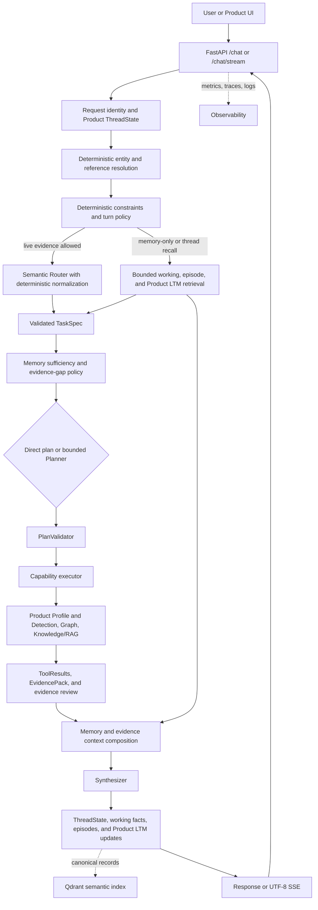

# Soorin Cyber Copilot

Soorin Cyber Copilot is a bounded, evidence-aware cybersecurity assistant for
SOC/NOC operations and asset intelligence in the Soorin platform. It combines
current Product Asset Profile and Detection evidence, observed Graph topology,
approved Knowledge/RAG material, and bounded conversation memory. Models explain
and correlate evidence; they do not become the authority for live operational
facts.

## Request Workflow



Entity and evidence authority is deterministic: an explicit entity in the
current message outranks a selected UI entity, which outranks the active session
entity. The semantic LLM Router is the normal intent decision source; application
validation, bounded planning, registered read-only capabilities, evidence review,
and safe fallbacks enforce its result. Detached general questions do not inherit
stale asset context, and incomplete or unavailable evidence is presented with
limitations rather than as a verified finding.

## Evidence Capabilities

- **Asset Profile:** current identity and profile data from the Product API.
- **Detection:** current classification and detection evidence from Product API
  views, with bounded context projections.
- **Graph:** observed NetworkX topology for summaries, neighbors, relationships,
  comparisons, and bounded paths.
- **Knowledge/RAG:** approved SOC documentation and runbooks through the configured
  Qdrant-backed retrieval service; it does not override current Product or Graph
  evidence.
- **Memory:** Product-backed ThreadState plus bounded working facts, recent turns,
  episodes, and typed durable Product LTM. Qdrant is semantic discovery for
  canonical LTM, not its authority. Memory reduces repeated work but does not
  replace required fresh operational evidence.

The role-based LLM layer separates a semantic Router, a bounded Planner for
multi-step retrieval, and a Synthesizer for the final grounded response. Context
composition reserves space for current evidence and output, compacts or omits
lower-priority history when necessary, and preserves source, freshness,
completeness, limitations, and citations.

## Run Locally

The canonical local configuration is the ignored repository-root `.env`; the
tracked `.env.example` documents the same current key set with safe placeholders.
Create the private file and configure credentials locally:

```bash
cp .env.example .env
```

Run the API or Streamlit UI with the project virtual environment:

```bash
PYTHONPATH=app .venv/bin/python app/run.py --api
PYTHONPATH=app .venv/bin/python app/run.py --web
```

Default native endpoints are `http://127.0.0.1:6998` for the API and
`http://127.0.0.1:8503` for Streamlit. `GET /health` is public; other API
endpoints use the configured Copilot API key. The current Docker/Compose workflow
also consumes the root `.env` and is documented in [Deployment](docs/DEPLOYMENT.md).

## Repository Guide

- `app/src/api`: FastAPI routes, authentication, streaming, Graph, and health.
- `app/src/core/copilot`: request facade and bounded workflow integration.
- `app/src/core/agent`: typed state, plans, capabilities, execution, and review.
- `app/src/core/context`: entity resolution, routing, views, and context budgets.
- `app/src/core/graph`: topology loading, retrieval, refresh, and visualization.
- `app/src/core/rag`: source, chunking, BGE embeddings, Qdrant, citations, and safety.
- `app/src/core/memory`: conversation, routing state, episodes, and typed memory.
- `app/src/core/observability`: logs, metrics, traces, usage, and evidence snapshots.

## Documentation

- [Current Architecture](docs/CURRENT_ARCHITECTURE.md)
- [Environment Variables](docs/ENVIRONMENT_VARIABLES.md)
- [Deployment](docs/DEPLOYMENT.md)
- [Observability](docs/OBSERVABILITY.md)
- [Frontend/Backend Integration](docs/FRONTEND_BACKEND_COPILOT_INTEGRATION.md)
- [Evidence-to-Context Audit](docs/INTERNAL_EVIDENCE_TO_MODEL_CONTEXT_AUDIT.md)
- [Memory and Context Design](docs/MEMORY_CONTEXT_UPGRADE_DESIGN.md)
- [Current Memory and Routing Audit](docs/MEMORY_WORKFLOW_CURRENT_DEV_AUDIT.md)
- [Agentic Foundation and RAG](docs/agentic-foundation-rag.md)

## Offline Checks

Use focused offline tests while developing:

```bash
PYTHONPATH=app .venv/bin/python -m unittest discover -s app/src/tests -p 'test_*.py' -v
```

Unit tests use local fakes and fixtures. They do not require Product, LLM,
Qdrant, Docker, Streamlit, or graph-refresh services.
