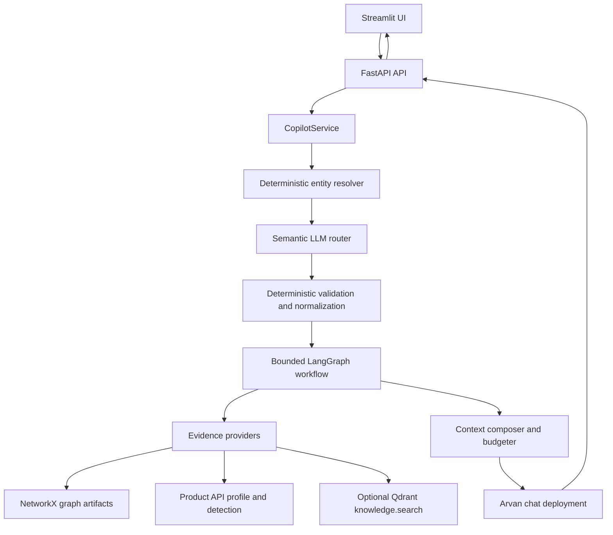

# Soorin Copilot

Soorin Copilot is a bounded cybersecurity copilot for SOC/NOC asset intelligence. The current implementation combines deterministic entity handling, an LLM-primary semantic router, operational product evidence, a NetworkX topology graph, optional SOC knowledge retrieval through Qdrant, and a Streamlit investigation workspace.

The project is intentionally conservative: current asset identity, detection, and topology evidence must come from deterministic providers; the LLM interprets, routes, and synthesizes over bounded context.

For the full audited design, implementation status, and known limitations, see [docs/CURRENT_ARCHITECTURE.md](docs/CURRENT_ARCHITECTURE.md).

## Architecture



## Repository Layout

```text
app/
  app_st.py                  Streamlit workspace
  prompts/                   System and router prompts
  src/api/                   FastAPI routes and graph endpoints
  src/config/                Environment-backed settings and LLM deployments
  src/core/agent/            Typed agent contracts, registry, reviewer, bounded workflow
  src/core/context/          Entity resolution, routing, provider context, composition
  src/core/copilot/          Main request orchestration service
  src/core/graph/            NetworkX graph build, storage, refresh, retrieval, visualization
  src/core/llm/              Provider-neutral LLM client and Arvan adapter
  src/core/memory/           In-memory conversation and routing state
  src/core/product_client/   Product API auth/client/schemas
  src/core/rag/              Qdrant-backed SOC knowledge retrieval foundation
  src/tests/                 Offline focused tests
script/
  refresh_graph.py           Manual product topology refresh
  fetch_graph_topology.py    Compatibility wrapper
docs/
  CURRENT_ARCHITECTURE.md    Authoritative audited architecture
```

Generated topology and vector-store data live under `data/` at runtime and should not be committed.

## Requirements

- Python 3.12 recommended.
- Docker with Compose for container deployment.
- Product API access only when fetching topology, profile, or detection evidence.
- Arvan/OpenAI-compatible chat-completions deployments for the router and final answer model.
- Optional Qdrant storage for SOC knowledge retrieval.
- Optional Hugging Face model cache for `BAAI/bge-base-en-v1.5` when indexing or searching RAG.

Install locally:

```bash
python -m venv .venv
source .venv/bin/activate
python -m pip install -r requirements.txt
```

## Configuration

Create local configuration files:

```bash
cp app/.env.example app/.env
cp compose.env.example compose.env
```

Then edit `app/.env`. Do not commit secrets.

Core settings:

```env
API_HOST=0.0.0.0
API_PORT=6998
SOORIN_API_BASE_URL=http://127.0.0.1:6998
STREAMLIT_SERVER_PORT=8503

SOORIN_INTENT_ROUTER_DEPLOYMENT=gpt55
SOORIN_CHAT_DEPLOYMENT=gpt55
SOORIN_LLM_GLM_BASE_URL=
SOORIN_LLM_GLM_API_KEY=
SOORIN_LLM_GPT55_BASE_URL=
SOORIN_LLM_GPT55_API_KEY=

SOORIN_PRODUCT_API_BASE_URL=
SOORIN_PRODUCT_API_TOKEN=
SOORIN_PRODUCT_USERNAME=
SOORIN_PRODUCT_PASSWORD=
SOORIN_PRODUCT_HWID=

SOORIN_RAG_ENABLED=false
SOORIN_RAG_BACKEND=qdrant
SOORIN_RAG_QDRANT_MODE=server
SOORIN_RAG_QDRANT_URL=http://127.0.0.1:6333
SOORIN_RAG_QDRANT_PATH=data/qdrant-local
SOORIN_RAG_EMBEDDING_MODEL=BAAI/bge-base-en-v1.5
SOORIN_RAG_EMBEDDING_DIMENSION=768
SOORIN_RAG_COLLECTION=soorin_soc_knowledge_bge_base_v1
```

Use `SOORIN_RAG_QDRANT_MODE=local` with `SOORIN_RAG_QDRANT_PATH` for embedded local Qdrant storage, or `server` with `SOORIN_RAG_QDRANT_URL` for an external Qdrant server.

## Local Run

Start the API:

```bash
PYTHONPATH=app python app/run.py --api
```

Start the Streamlit workspace in another shell:

```bash
PYTHONPATH=app python app/run.py --web
```

Default local URLs:

- API: `http://127.0.0.1:6998`
- UI: `http://127.0.0.1:8503`

## Docker Run

Build and start without changing tracked configuration:

```bash
make build
make up
make health
```

The Compose stack runs:

- `api`: FastAPI on container port `6998`, mapped to host `${SOORIN_API_PORT:-6998}`.
- `ui`: Streamlit on container port `8501`, mapped to host `${SOORIN_UI_PORT:-8503}`.

Stop while preserving volumes:

```bash
make down
```

## API

Health:

```bash
curl -fsS http://127.0.0.1:6998/health
curl -fsS http://127.0.0.1:6998/llm/health
```

Chat:

```bash
curl -fsS http://127.0.0.1:6998/chat \
  -H 'Content-Type: application/json' \
  -d '{"session_id":"demo","message":"What is Kerberos?"}'
```

Streaming chat:

```bash
curl -N http://127.0.0.1:6998/chat/stream \
  -H 'Content-Type: application/json' \
  -d '{"session_id":"demo","message":"Tell me briefly about 192.168.21.1."}'
```

Graph endpoints:

```bash
curl -fsS http://127.0.0.1:6998/graph/status
curl -fsS http://127.0.0.1:6998/graph/stats
curl -fsS http://127.0.0.1:6998/graph/nodes/192.168.21.1
curl -fsS 'http://127.0.0.1:6998/graph/nodes/192.168.21.1/neighbors?direction=both&limit=20'
curl -fsS 'http://127.0.0.1:6998/graph/path?source=192.168.21.1&target=192.168.21.10'
```

## Graph Refresh

Manual topology refresh calls the configured Product API and writes graph artifacts:

```bash
PYTHONPATH=app python script/refresh_graph.py
```

`script/fetch_graph_topology.py` is a compatibility wrapper around the same refresh command.

At API startup, the service loads the last-known-good graph artifact first. If graph auto-refresh is enabled, a background refresh loop can fetch, validate, persist, and atomically activate newer product topology snapshots.

## RAG Indexing

The SOC knowledge corpus should normally be mounted or referenced outside this repository through `SOORIN_RAG_SOURCE_ROOT`.

Validate the corpus without embeddings or writes:

```bash
PYTHONPATH=app python -m src.core.rag.indexer
```

Build or update the Qdrant index only when you explicitly intend to load the embedding model, generate embeddings, and write records:

```bash
PYTHONPATH=app SOORIN_RAG_ENABLED=true python -m src.core.rag.indexer --build
```

Current default embedding model:

```text
BAAI/bge-base-en-v1.5, dimension 768
```

Legacy SecureBERT collections are rejected by configuration validation to avoid silently reusing incompatible vectors.

## Tests

Focused tests:

```bash
PYTHONPATH=app python -m pytest app/src/tests/test_agentic_rag_foundation.py -q
PYTHONPATH=app python -m pytest app/src/tests/test_chat_streaming.py -q
PYTHONPATH=app python -m unittest app.src.tests.test_context_routing -v
```

Full offline test discovery:

```bash
PYTHONPATH=app python -m unittest discover -s app/src/tests -p "test_*.py" -v
```

Compile:

```bash
PYTHONPATH=app python -m compileall -q app
```

## Limits

- The graph is an observed communication graph, not proof of physical routing, trust, compromise, or reachability.
- Product profile and detection providers return current product evidence when configured; failures are surfaced as unavailable or stale fallback, not verified facts.
- RAG is optional and documentation-oriented. It is not source of truth for current assets, detections, graph edges, alerts, risk values, or peer lists.
- The LangGraph workflow is bounded and direct. A full planner, Neo4j, SIEM actions, MCP, remediation, durable checkpoints, and long-term memory are deferred.
- Conversation and routing state are in-memory per process.
- Streaming preserves Unicode over SSE; clients should parse UTF-8 SSE events instead of re-decoding text manually.
