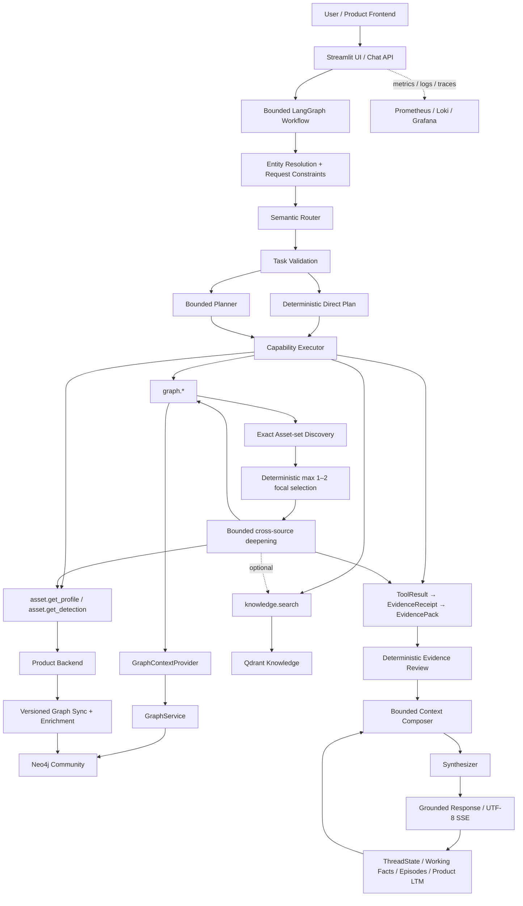

# Soorin Cyber Copilot

Soorin Cyber Copilot is a bounded, evidence-aware assistant for SOC, NOC, NDR, threat-intelligence, and asset-intelligence workflows in the Soorin platform.

It combines current Product evidence, a versioned Neo4j organizational/topology projection, approved Knowledge/RAG sources, and bounded conversation memory. LLMs route, plan when needed, correlate, and explain evidence; deterministic runtime policy remains authoritative for entity binding, tool limits, evidence validation, context budgets, and live operational truth.

## Architecture



## Request Workflow

A request moves through a bounded workflow:

1. Resolve entities from explicit message content, UI context, and authorized conversation state.
2. Apply deterministic request constraints such as current/live evidence, memory-only recall, or memory writes.
3. Route semantic intent with the Router.
4. Validate the task and use either a deterministic direct plan or one bounded Planner proposal.
5. Execute registered read-only Product, Graph, and Knowledge capabilities.
6. For exact Asset search, keep the result as an Asset set. If the user requested analysis and a focal choice is deterministic, select at most one or two Assets and deepen only those through existing Product/Detection/Graph capabilities.
7. Build and deterministically review a unified EvidencePack.
8. Compose bounded context with source, freshness, completeness, truncation, limitations, and authorized memory provenance.
9. Synthesize the analyst-facing response and persist bounded continuity.

Application validation and evidence policy remain authoritative even when Router or Planner output is incomplete.

## Exact Asset Search and Phase 4C

The structured Graph path supports bounded exact/range Asset discovery and count/group-count aggregation over allow-listed properties. It exposes no raw Cypher, arbitrary properties, regex, OR-expression, or operator escape hatch.

The finalized investigation flow is:

```text
Exact Search
→ bounded discovery
→ deterministic max 1–2 focal Assets
→ verified Product Profile / Detection
→ bounded Graph topology when needed
→ optional Knowledge when useful
→ unified evidence
→ grounded answer
→ bounded StructuredQueryContext continuity
```

Plain list/search requests do not trigger automatic Product calls. Multi-result deepening requires deterministic selection semantics; ambiguous selection fails closed. The global capability-call limit and two-focal-entity limit remain unchanged, so a large search result can never become N-way Product fan-out.

Search rows are organizational discovery evidence, not conversational entities. Product remains authoritative for current/deep Asset and Detection facts. The Synthesizer explicitly distinguishes the discovered set from deeper findings verified for selected focal Assets.

## Evidence and Authority

- **Product Backend**: authoritative current/deep Asset Profile and Detection evidence.
- **Neo4j Community**: versioned organizational discovery projection and bounded topology.
- **Qdrant Knowledge**: approved SOC/NOC/NDR/TI documentation and background knowledge.
- **Memory**: conversation/investigation continuity and validated historical findings, never a replacement for required fresh operational evidence.

Current Product evidence is not silently replaced by Graph enrichment when Product verification is unavailable. Reviewer limitations preserve that source boundary.

## Graph Runtime

The graph runtime uses **Neo4j Community 2026.07.1**. Product topology and enrichment are synchronized into a versioned projection; only the published active graph version is queried. Failed refreshes preserve the last-known-good version.

Structured search supports fixed exact selectors such as IP, asset name, status, suggested type, role/roles membership, vendor, product, tag/sub-tag and enrichment status; bounded confidence/time ranges; fixed sort fields; and fixed aggregation/grouping fields. Returned rows can contain additional enrichment metadata, but internal graph-version authority and scheduler metadata are not exposed as arbitrary user filters.

The active runtime does not depend on NetworkX, pickle, GraphML, or GEXF artifacts.

## Memory and Continuity

Memory is bounded and typed:

- active ThreadState and entity/pair continuity;
- explicit analyst working facts;
- recent-turn summaries and compact digests;
- episodic investigation context;
- Product-backed durable long-term memory;
- `StructuredQueryContext` for the latest bounded structured result set.

Structured search rows do not consume the two-entity budget and do not automatically become active entities. Phase 4C focal selection is execution-local; structured-search turns do not write a focal investigation baseline under an empty set-level context. Explicit current-message entities continue to outrank fallback UI/active context under the existing authority rules.

Pure memory recall does not intentionally refresh live evidence. Current operational evidence continues to outrank remembered conclusions when current verification is required.

## Models and Prompts

The LLM layer has three roles:

- **Router**: semantic intent/scope plus typed structured-query semantics.
- **Planner**: bounded multi-step planning only when deterministic direct execution is insufficient.
- **Synthesizer**: grounded final analysis from validated evidence and authorized memory context.

Exact structured search uses deterministic direct execution. Post-search candidate selection/deepening is also deterministic and does not add another LLM call. Router and Planner prompt contracts already enforce selector-vs-entity and capability boundaries; the Synthesizer search module additionally distinguishes set discovery from verified focal analysis.

## Local Run

Create the private repository-root configuration from the tracked example:

```bash
cp .env.example .env
```

Run the API:

```bash
PYTHONPATH=app .venv/bin/python app/run.py --api
```

Run the Streamlit UI:

```bash
PYTHONPATH=app .venv/bin/python app/run.py --web
```

Default native endpoints:

- API: `http://127.0.0.1:6998`
- Streamlit: `http://127.0.0.1:8503`

`GET /health` is public. Protected API endpoints use the configured Copilot API key.

## Repository Guide

- `app/src/api` — FastAPI, streaming, authentication, graph, and health routes.
- `app/src/core/agent` — workflow state, routing/planning integration, capabilities, specialists, evidence review, structured continuity, and Phase 4C bounded deepening.
- `app/src/core/context` — entity resolution, evidence providers, projections, prompt/context construction, and token budgets.
- `app/src/core/graph` — Product topology/enrichment synchronization, Neo4j repository, graph policy, exact structured retrieval, and graph service.
- `app/src/core/memory` — ThreadState, structured-result continuity, working facts, episodes, retrieval, and Product LTM integration.
- `app/src/core/rag` — embeddings, Qdrant retrieval, knowledge sources, and citations.
- `app/src/core/observability` — logs, metrics, traces, usage reporting, and evidence diagnostics.

## Phase Status

```text
Phase 1       DONE
Phase 2       DONE
Phase 2.5     PASS
Phase 3       DONE
Phase 3.5     DONE
Phase 4A      DONE
Phase 4A.1    DONE / VALIDATED
Phase 4B.1    DONE
Phase 4B.2    DONE
Phase 4B.3    DONE
Phase 4B.4    DONE
Phase 4C      DONE / VALIDATED
```

Final validated Phase 4C code commit `613dab022cb9e5f58690e0f193b034613f7cf010` passed `237` targeted tests (`41` skipped, `62` subtests), `5` structured Neo4j integration tests, and `14` Community parity tests. The read-only Neo4j query-plan audit reported `writes_performed=false`.

## Deployment and Documentation

Primary operational references:

- [Current Architecture](docs/CURRENT_ARCHITECTURE.md)
- [Phase 4 Structured Graph Routing](docs/PHASE4_STRUCTURED_GRAPH_ROUTING.md)
- [Phase 4C Exact Search Finalization](docs/PHASE4C_EXACT_SEARCH_FINALIZATION.md)
- [Neo4j Enrichment / GraphRAG](docs/NEO4J_GRAPH_ENRICHMENT_GRAPHRAG.md)
- [Deployment](docs/DEPLOYMENT.md)
- [Environment Variables](docs/ENVIRONMENT_VARIABLES.md)
- [Observability](docs/OBSERVABILITY.md)
- [Frontend / Backend Integration](docs/FRONTEND_BACKEND_COPILOT_INTEGRATION.md)
- [Evidence-to-Context Audit](docs/INTERNAL_EVIDENCE_TO_MODEL_CONTEXT_AUDIT.md)
- [Memory and Context Design](docs/MEMORY_CONTEXT_UPGRADE_DESIGN.md)

## Validation

```bash
PYTHONPATH=app .venv/bin/python -m pytest -q app/src/tests
```

The Phase 4 GitHub validation workflow additionally runs targeted Router/structured-search/Phase 4C regressions, disposable Neo4j structured integration, the read-only query-plan audit, and Neo4j Community parity tests. Mutating graph tests must never target the production or main local Neo4j instance.