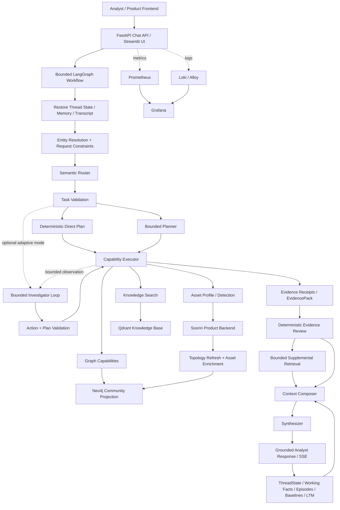

# Soorin Cyber Copilot

Soorin Cyber Copilot is an evidence-aware, graph-aware cybersecurity assistant for SOC, NOC, NDR, threat-intelligence, and asset-intelligence workflows in the Soorin platform.

It combines live Product evidence, a versioned Neo4j organizational topology, approved RAG knowledge, bounded conversation and investigation memory, and role-based LLM reasoning. Deterministic application policy remains authoritative for tool access, evidence validation, context budgets, and operational truth.

## Architecture



## Core Workflow

Every request moves through a bounded investigation pipeline:

1. Restore the authorized thread state, recent transcript context, working memory, episodic context, and eligible long-term memory.
2. Resolve explicit entities, UI-selected context, active investigation state, and current request constraints.
3. Route the request with the semantic Router into a typed intent and structured query when applicable.
4. Validate the task deterministically and choose direct, fixed Planner, or feature-flagged bounded adaptive orchestration. Adaptive turns use stable evidence references, normalized action fingerprints, conservative equivalent-action suppression, and delta-only Investigator state.
5. Execute only registered read-only capabilities with entity, depth, concurrency, timeout, and call-count limits.
6. Normalize tool output into evidence receipts and a unified `EvidencePack` carrying freshness, completeness, provenance, and truncation metadata.
7. Review required evidence deterministically and perform at most the configured bounded supplemental retrieval when evidence gaps remain.
8. Compose a token-bounded context from current evidence, graph context, knowledge, and authorized memory. Investigator context is compacted separately from final Synth evidence, with authority sections retained and pre/post token estimates recorded.
9. Synthesize the analyst-facing answer and persist bounded continuity for the next turn.

## Capabilities

The runtime exposes a typed read-only capability registry:

- `asset.get_profile` — current Product asset profile evidence.
- `asset.get_detection` — Product detection evidence with bounded model-facing views.
- `graph.get_summary` — graph identity and degree/topology summary.
- `graph.get_neighbors` — bounded one-hop or broader neighbor retrieval.
- `graph.get_relationship` — direct relationship evidence between assets.
- `graph.compare_assets` — deterministic topology comparison for two assets.
- `graph.find_path` — bounded path discovery.
- `graph.search_assets` — exact/range structured asset discovery.
- `graph.aggregate_assets` — count and grouped aggregation over approved fields.
- `knowledge.search` — approved SOC/NOC/NDR/TI knowledge retrieval from Qdrant.

Capability execution is bounded by the application contract rather than by arbitrary model-generated tool calls.

## Structured Asset Discovery and Deep Investigation

Structured discovery is executed directly against the active Neo4j projection using typed, allow-listed selectors. Search rows remain an asset set and do not automatically become conversational entities.

```text
Structured Asset Query
→ graph.search_assets / graph.aggregate_assets
→ bounded Asset-set evidence
→ deterministic focal selection when unambiguous and analysis is requested
→ Product Profile + Detection + Graph deepening for selected focal assets
→ unified evidence review
→ bounded context
→ grounded response
→ StructuredQueryContext continuity
```

Supported structured fields include IP, asset name, inventory status, suggested type, role and roles membership, vendor, product, tag/sub-tag, enrichment status, bounded confidence ranges, and bounded time ranges. Aggregation uses fixed approved grouping fields and never exposes raw Cypher.

## Evidence Authority

Soorin Copilot keeps source authority explicit:

- **Product Backend** is authoritative for current/deep Asset Profile and Detection evidence.
- **Neo4j Community** is the versioned organizational discovery and communication-topology projection.
- **Qdrant Knowledge** provides approved cybersecurity reference material and background knowledge.
- **Memory** provides conversation continuity and validated historical findings while current operational evidence remains authoritative when fresh verification is required.

Evidence is carried with provenance, freshness, completeness, truncation, and safe limitations before it reaches the Synthesizer.

## Graph Runtime

The graph runtime uses **Neo4j Community 2026.07.1**. Product topology is synchronized into a versioned graph projection and only the active published graph version is queried. Asset enrichment adds bounded Product-derived identity and classification properties to graph nodes. Failed refreshes preserve the last known good projection.

The active runtime provides exact asset discovery, aggregation, node summary, neighbor analysis, relationship analysis, comparison, and path finding. The graph execution path is read-only from Copilot query capabilities.

## Memory and Continuity

Memory is bounded and typed:

- active entity and active-pair continuity;
- durable ThreadState;
- explicit analyst working facts;
- recent raw turns, compact digests, and summaries;
- investigation episodes;
- investigation baselines and deltas;
- `StructuredQueryContext` for bounded structured-result continuity;
- Product-backed typed long-term memory when configured.

Current evidence and memory are composed under explicit token budgets. Memory is used for continuity and historical context, while live-evidence requirements continue to trigger current Product/Graph retrieval.

## LLM Layer

The model layer has four independently configured roles:

- **Router** — intent, scope, evidence needs, and typed structured-query semantics.
- **Planner** — bounded multi-step planning when deterministic direct execution is insufficient.
- **Investigator** — strict, one-action-at-a-time evidence selection for eligible adaptive investigations; deterministic validators retain authority.
- **Synthesizer** — grounded correlation and final analyst-facing explanation.

The shared transport is OpenAI-compatible and supports these provider types:

- `arvan`
- `vllm`
- `ollama`
- `openai_compatible`

Router, Planner, Investigator, and Synthesizer have independent base URLs, model names, API-key fields, token budgets, and timeouts while sharing the selected provider policy. Adaptive mode defaults off; repeated no-progress turns stop safely, and the final evidence/Synth path remains unchanged. See [Bounded Adaptive Investigator Workflow](docs/AUTONOMOUS_AGENT_WORKFLOW.md).

Adaptive production readiness is evaluated separately with a versioned RFC 5737 synthetic corpus. Deterministic replay makes no LLM or live provider calls; explicit model-backed shadow replay calls only the configured Investigator and supplies synthetic tool results after production validation. Passing local gates does not enable the flag or substitute for staging/canary evidence. See [Adaptive Investigator Evaluation and Rollout](docs/AUTONOMOUS_AGENT_EVALUATION.md).

## Knowledge / RAG

Knowledge retrieval uses local Qdrant and Hugging Face embeddings. The deployment keeps the Qdrant corpus and Hugging Face model cache outside the Docker image so rebuilds remain reproducible and do not duplicate model/data storage.

The normal runtime loads the configured embedding model from the mounted Hugging Face cache with local-files-only behavior inside the API container.

## API and UI

The project provides:

- FastAPI chat and health endpoints;
- UTF-8 server-sent-event streaming for reasoning/answer progress and usage metadata;
- authenticated graph endpoints;
- Streamlit development/product UI;
- Product-backed conversation integration;
- dual Copilot API authentication compatibility through the dedicated Copilot API-key header and Bearer fallback.

The Streamlit container communicates with the API through the Compose service network at `http://api:6998`.

## Observability

The optional Compose observability profile includes:

- **Prometheus** for Copilot metrics;
- **Loki** for log storage;
- **Alloy** for Docker log collection;
- **Grafana** for dashboards and exploration.

Application logs support console or JSON formatting, rotating local files, request/workflow identifiers, provider latency and token metadata, human traces, and optional bounded evidence snapshots.

## Deployment

The repository uses one private root `.env` and a tracked `.env.example` schema. The production image is multi-stage, Python 3.12 based, CPU-only for Torch, and runs as the non-root `soorin` user.

Important persistent/runtime resources are external to the image:

- repository `data/` → `/workspace/data` read/write;
- `SOORIN_HF_CACHE_HOST_PATH` → `/home/soorin/.cache/huggingface` read-only;
- Neo4j named volumes for database and logs;
- observability named volumes for Prometheus, Loki, and Grafana.

Deployment validation is provided by the Makefile:

```bash
make show-config
make config
make preflight
make deploy
make health
```

`make preflight` validates the private environment, runtime data tree, Qdrant metadata/collection, configured Hugging Face embedding snapshot and dimension, and Compose configuration before an image is started.

## Repository Layout

- `app/src/api` — FastAPI routes, streaming, authentication, health, and graph API.
- `app/src/core/agent` — LangGraph workflow, task contracts, planning, capabilities, evidence review, and bounded deepening.
- `app/src/core/context` — entity resolution, provider projections, evidence/context composition, and token budgets.
- `app/src/core/graph` — Neo4j repository, graph services, structured retrieval, refresh, and enrichment.
- `app/src/core/memory` — ThreadState, working memory, episodes, baselines, retrieval, Product LTM, and structured continuity.
- `app/src/core/rag` — Qdrant retrieval, embeddings, indexing foundations, and knowledge citations.
- `app/src/core/llm` — provider-neutral role-based LLM transport.
- `app/src/core/observability` — logging, metrics, traces, usage reporting, and evidence diagnostics.
- `observability/` — Prometheus, Loki, Alloy, and Grafana configuration.
- `docs/` — canonical architecture, deployment, integration, graph, memory, environment, and observability documentation.

## Documentation

Canonical operational references:

- [Documentation Index](docs/README.md)
- [Current Architecture](docs/CURRENT_ARCHITECTURE.md)
- [Deployment](docs/DEPLOYMENT.md)
- [Environment Variables](docs/ENVIRONMENT_VARIABLES.md)
- [Frontend / Backend Integration](docs/FRONTEND_BACKEND_COPILOT_INTEGRATION.md)
- [Neo4j Graph and Enrichment](docs/NEO4J_GRAPH_ENRICHMENT_GRAPHRAG.md)
- [Observability](docs/OBSERVABILITY.md)
- [Bounded Adaptive Investigator Workflow](docs/AUTONOMOUS_AGENT_WORKFLOW.md)
- [Adaptive Investigator Evaluation and Rollout](docs/AUTONOMOUS_AGENT_EVALUATION.md)

## Validation

Run the repository test suite with:

```bash
PYTHONPATH=app .venv/bin/python -m pytest -q app/src/tests
```

Run the safe deterministic adaptive release gate with:

```bash
make agent-eval
```

Run real-Investigator shadow replay explicitly (configured model required and tokens are consumed) with:

```bash
make agent-eval-model
```

`SOORIN_ADAPTIVE_AGENT_ENABLED` remains `false` by default. Deterministic replay supports model-replay readiness; model replay supports staging readiness; canary telemetry and explicit review are required before default enablement.

Deployment-level validation additionally uses `make config`, `make preflight`, `make preflight-image`, `make inspect-image`, and `make health`.
