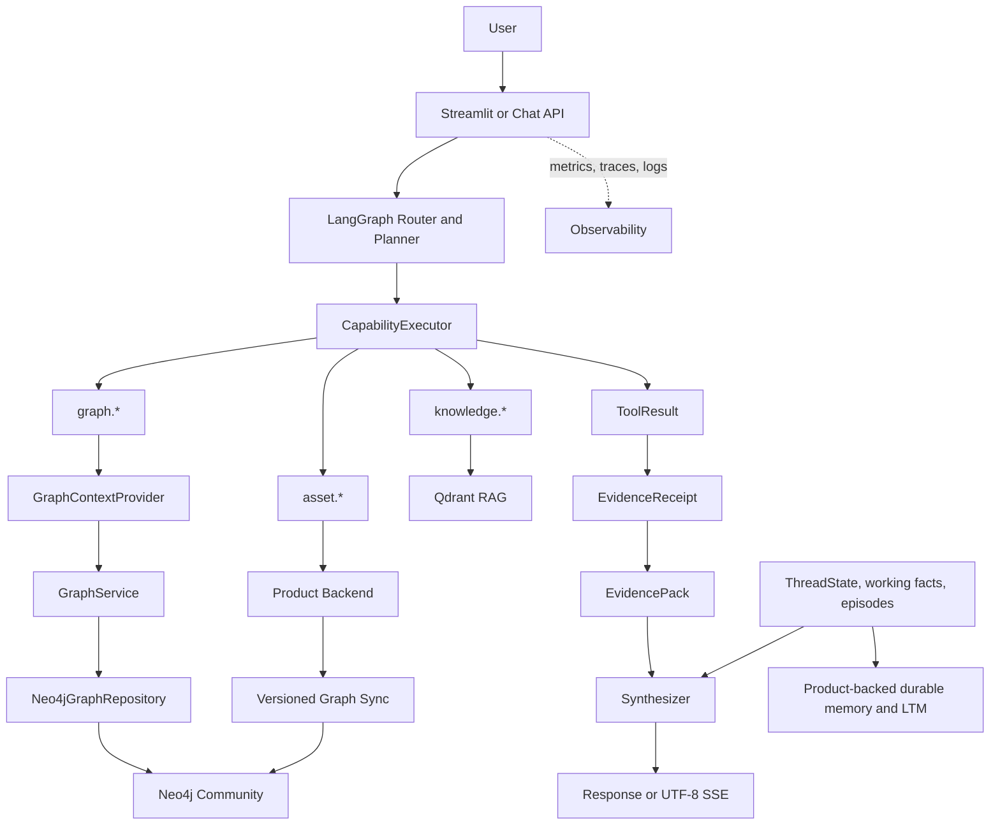

# Soorin Cyber Copilot

Soorin Cyber Copilot is a bounded, evidence-aware cybersecurity assistant for
SOC/NOC operations and asset intelligence in the Soorin platform. It combines
current Product Asset Profile and Detection evidence, observed Graph topology,
approved Knowledge/RAG material, and bounded conversation memory. Models explain
and correlate evidence; they do not become the authority for live operational
facts.

## Current Architecture



Entity and evidence authority is deterministic: an explicit entity in the
current message outranks a selected UI entity, which outranks the active session
entity. The semantic LLM Router is the normal intent decision source; application
validation, bounded planning, registered read-only capabilities, evidence review,
and safe fallbacks enforce its result. Detached general questions do not inherit
stale asset context, and incomplete or unavailable evidence is presented with
limitations rather than as a verified finding.

## Evidence Capabilities

- **Asset Profile:** current identity and profile data from the Product API.
- **Detection:** current classification and detection evidence from Product API
  views, with bounded context projections.
- **Graph:** the current bounded Neo4j Community projection for summaries,
  neighbors, relationships, comparisons, and directed paths. Product remains the
  topology source of truth.
- **Knowledge/RAG:** approved SOC documentation and runbooks through the configured
  Qdrant-backed retrieval service; it does not override current Product or Graph
  evidence.
- **Memory:** Product-backed ThreadState plus bounded working facts, recent turns,
  episodes, and typed durable Product LTM. Qdrant is semantic discovery for
  canonical LTM, not its authority. Memory reduces repeated work but does not
  replace required fresh operational evidence.

The role-based LLM layer separates a semantic Router, a bounded Planner for
explicit open-ended multi-step retrieval, and a Synthesizer for the final
grounded response. A deterministic task envelope preserves resolved entity order,
comparison intent, temporal authority, and live-evidence constraints across
router fallback and planning. Context composition reserves space for current
evidence and output, compacts or omits lower-priority history when necessary,
and preserves source, freshness, completeness, limitations, and citations.

ThreadState stores bounded continuity: active routing state, a chronological
entity-visit timeline, working facts, compact turn digests, and episodic
summaries. Product Long-Term Memory is canonical for durable validated findings;
Qdrant is derivative semantic retrieval only. Evidence acquisition receipts are
immutable snapshots for baseline comparison, independent of later model-context
projection or compaction.

Pure memory recall is read-only with respect to the operational entity cursor
and active episode. Recall context carries entity/source/temporal provenance and
explicit bounded-coverage metadata. Investigation baselines use deterministic
canonical projections when full Product views are too large, preserving every
required capability without storing arbitrary provider JSON.

The graph baseline is a single Neo4j Community 2026.07.1 instance. Product
topology sync publishes versioned projections every 3600 seconds by default;
failed refreshes preserve the last-known-good version. Raw Product topology JSON
is retained only for audit/debugging. There is no active NetworkX, pickle,
GraphML, or GEXF graph runtime. Streamlit uses authenticated Graph APIs, polls
the small status/version response about every 30 seconds, and refetches bounded
topology/stats only when the active version or user filters change.

Authority is deliberately separated: Product owns topology truth; Neo4j holds
the current graph projection/evidence; memory owns conversation and
investigation continuity; Qdrant supplies knowledge/RAG and derivative semantic
memory lookup.

## Run Locally

The canonical local configuration is the ignored repository-root `.env`; the
tracked `.env.example` documents the same current key set with safe placeholders.
Create the private file and configure credentials locally:

```bash
cp .env.example .env
```

Run the API or Streamlit UI with the project virtual environment:

```bash
PYTHONPATH=app .venv/bin/python app/run.py --api
PYTHONPATH=app .venv/bin/python app/run.py --web
```

Default native endpoints are `http://127.0.0.1:6998` for the API and
`http://127.0.0.1:8503` for Streamlit. `GET /health` is public; other API
endpoints use the configured Copilot API key. The current Docker/Compose workflow
also consumes the root `.env` and is documented in [Deployment](docs/DEPLOYMENT.md).

## Repository Guide

- `app/src/api`: FastAPI routes, authentication, streaming, Graph, and health.
- `app/src/core/copilot`: request facade and bounded workflow integration.
- `app/src/core/agent`: typed state, plans, capabilities, execution, and review.
- `app/src/core/context`: entity resolution, routing, views, and context budgets.
- `app/src/core/graph`: Product topology sync, Neo4j repository, bounded query
  policy, service, and provider integration.
- `app/src/core/rag`: source, chunking, BGE embeddings, Qdrant, citations, and safety.
- `app/src/core/memory`: conversation, routing state, episodes, and typed memory.
- `app/src/core/observability`: logs, metrics, traces, usage, and evidence snapshots.

## Documentation

- [Current Architecture](docs/CURRENT_ARCHITECTURE.md)
- [Environment Variables](docs/ENVIRONMENT_VARIABLES.md)
- [Deployment](docs/DEPLOYMENT.md)
- [Observability](docs/OBSERVABILITY.md)
- [Frontend/Backend Integration](docs/FRONTEND_BACKEND_COPILOT_INTEGRATION.md)
- [Evidence-to-Context Audit](docs/INTERNAL_EVIDENCE_TO_MODEL_CONTEXT_AUDIT.md)
- [Memory and Context Design](docs/MEMORY_CONTEXT_UPGRADE_DESIGN.md)
- [Current Memory and Routing Audit](docs/MEMORY_WORKFLOW_CURRENT_DEV_AUDIT.md)
- [Agentic Foundation and RAG](docs/agentic-foundation-rag.md)

## Offline Checks

Use focused offline tests while developing:

```bash
PYTHONPATH=app .venv/bin/python -m pytest app/src/tests -q
```

Unit tests use local fakes and fixtures. They do not require Product, LLM,
Qdrant, Docker, Streamlit, or graph-refresh services.
