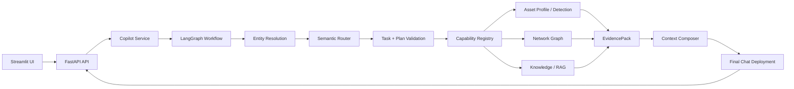

# Soorin Cyber Copilot

Soorin Cyber Copilot is a bounded cybersecurity investigation assistant for SOC/NOC and asset-intelligence workflows. It combines current operational evidence from Soorin product integrations, observed network topology, approved knowledge/RAG sources, session memory, and LLM-based synthesis behind a deterministic, evidence-aware workflow.

The project is designed to answer asset, detection, topology, comparison, path, and general cybersecurity questions without letting the model invent live operational facts.

## What It Does

- Answers general cybersecurity questions and SOC/NOC investigation prompts.
- Resolves explicit IPs, selected UI graph nodes, and active session entities with deterministic authority rules.
- Routes requests through a semantic LLM router plus strict deterministic validation.
- Fetches current Asset Profile and Detection evidence when required.
- Retrieves NetworkX graph evidence for summaries, neighbors, relationships, comparisons, and paths.
- Searches approved knowledge/RAG material when the route requires documentation evidence.
- Builds a bounded final model context with source, freshness, completeness, limitations, and citations.
- Streams or returns final answers through the existing FastAPI chat API.
- Provides a Streamlit UI for chat, topology exploration, and graph-assisted Copilot prompts.

## Core Capabilities

- Asset profile lookup
- Asset detection and classification evidence
- Graph node summary
- Direct neighbors and two-hop neighborhoods
- Direct relationship between two assets
- Asset comparison
- Shortest graph path
- Knowledge/RAG search over approved SOC documentation
- Conversation continuity with active asset and pair state
- Usage, trace, and evidence observability without logging secrets

## Architecture



## Main Components

- `app/src/api`: FastAPI routes for chat, streaming, health, graph, evidence, and internal usage.
- `app/src/web`: Streamlit web UI and topology page.
- `app/src/core/copilot`: Copilot service facade and request lifecycle.
- `app/src/core/agent`: bounded LangGraph workflow, contracts, planner, validators, specialists, and evidence reviewer.
- `app/src/core/context`: entity resolution, semantic routing, context composition, and Product evidence views.
- `app/src/core/graph`: product topology fetching, graph building/loading/querying, retrieval, and visualization helpers.
- `app/src/core/rag`: knowledge/RAG contracts, embedding abstraction, Qdrant vector store, retrieval, citations, and safety.
- `app/src/core/llm`: provider-neutral LLM client and Arvan-compatible deployments.
- `app/src/core/memory`: process-local session history, routing state, and bounded summaries.
- `app/src/core/observability`: logging, tracing, usage recording, and evidence snapshots.

## Quick Start

Create local environment files:

```bash
cp app/.env.example app/.env
cp compose.env.example compose.env
```

Edit `app/.env` and `compose.env` locally. Do not commit secrets.

Build and start:

```bash
make build
make up
```

Check health and logs:

```bash
make health
make logs
```

Stop services:

```bash
make down
```

## Configuration Overview

The application reads `app/.env` first, then environment variables. Compose-level host bindings and image settings live in `compose.env`.

Important configuration groups:

- API/UI: `API_HOST`, `API_PORT`, `SOORIN_API_BASE_URL`, `STREAMLIT_SERVER_PORT`
- LLM: Kimi router/chat, GLM Planner, retained GPT compatibility, provider-neutral gateway settings, timeouts, and token limits
- Product API: base URL, topology/profile/detection/login paths, token or login credentials, HWID
- Graph: artifact paths, refresh policy, retrieval caps, UI limits, context budgets
- RAG: enable flag, source root, Qdrant mode/server/local path, collection, BGE embedding model/dimension
- Memory and observability: history limits, trace detail, request-local usage reporting, and evidence snapshots

This release has no LangGraph checkpoint persistence. Workflow execution remains bounded and active, while conversation/routing memory remains process-local.

Secrets such as API keys, product credentials, and Qdrant API keys must remain in local environment files or deployment secret stores.

## API and UI Access

Default local endpoints:

- API: `http://127.0.0.1:6998`
- UI: `http://127.0.0.1:8503`

Useful API checks:

```bash
curl http://127.0.0.1:6998/health
curl http://127.0.0.1:6998/llm/health
```

Example chat request:

```bash
curl -X POST http://127.0.0.1:6998/chat \
  -H 'Content-Type: application/json' \
  -d '{"session_id":"demo","message":"Tell me about 192.168.21.1."}'
```

## Testing

Run the containerized default test target:

```bash
make test
```

Run local focused Python checks when working in the virtual environment:

```bash
PYTHONPATH=app .venv/bin/python -m unittest discover -s app/src/tests -p 'test_*.py' -v
```

Use offline tests for routing, graph, RAG, context budgeting, evidence contracts, and streaming. Do not call live Product, LLM, Qdrant, FastAPI, Streamlit, Docker, or indexing flows from unit tests.

## Documentation

- `docs/CURRENT_ARCHITECTURE.md`: implemented architecture and runtime contracts.
- `docs/INTERNAL_EVIDENCE_TO_MODEL_CONTEXT_AUDIT.md`: evidence-to-model-context audit and known integrity rules.
- `docs/AGENTIC_FOUNDATION_RAG.md`: agentic workflow and RAG foundation notes.
- `docs/PHASE2_*`: Phase 2 and 2.1 implementation and audit records.
- `.agents/skills/`: project skills for architecture, runtime, and agentic workflow work.
