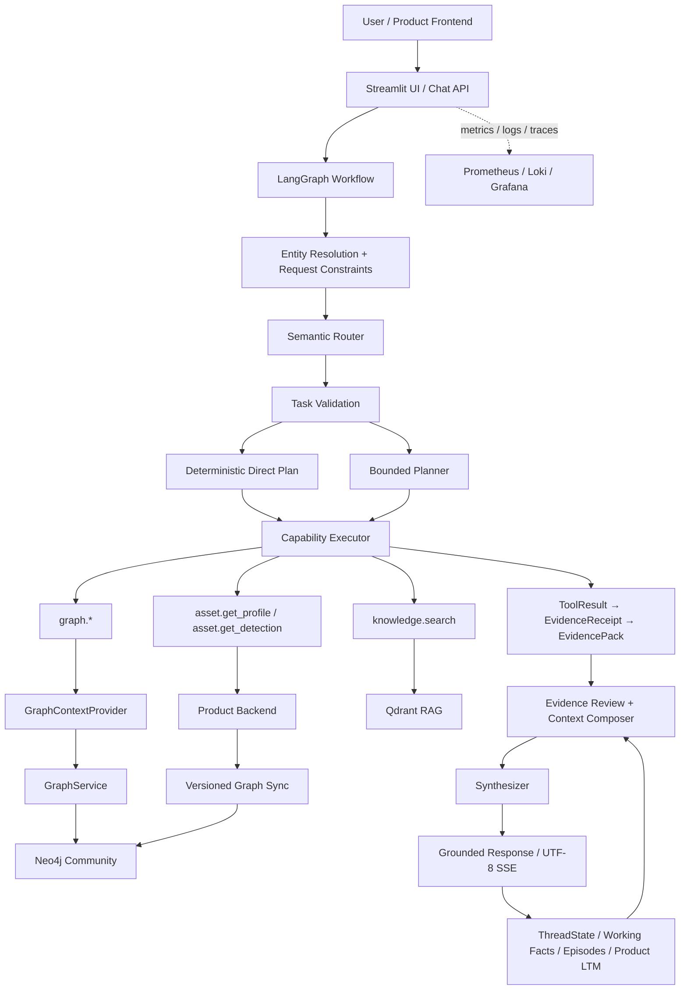

# Soorin Cyber Copilot

Soorin Cyber Copilot is a bounded, evidence-aware assistant for SOC, NOC, NDR, threat-intelligence, and asset-intelligence workflows in the Soorin platform.

It combines current Product evidence, a Neo4j operational graph projection, approved Knowledge/RAG sources, and bounded conversation memory. LLMs route, correlate, and explain evidence; they are not the authority for live operational facts.

## Architecture



## Request Workflow

A request moves through a bounded LangGraph workflow:

1. **Resolve entities** from the message, UI context, and active conversation state.
2. **Apply request constraints** such as live/current evidence, memory-only recall, or memory writes.
3. **Route intent** with the semantic Router.
4. **Validate the task** and use either a deterministic direct plan or the bounded Planner for multi-step work.
5. **Execute registered read-only capabilities** through specialized asset, graph, and knowledge paths.
6. **Build and review evidence** before it reaches the model.
7. **Compose bounded context** with source, freshness, completeness, limitations, and memory provenance.
8. **Synthesize the response** and persist bounded conversation/investigation state.

Application validation and evidence policy remain authoritative even when Router or Planner output is incomplete.

## Evidence and Authority

The main evidence sources are deliberately separated:

- **Product Backend**: authoritative current asset profile, detection data, and topology source.
- **Neo4j Community**: current operational graph projection used for graph evidence.
- **Qdrant RAG**: approved SOC/NOC/NDR/TI knowledge and runbook retrieval.
- **Memory**: conversation and investigation continuity, not a replacement for required fresh operational evidence.

Registered graph capabilities include bounded summaries, neighbors, direct relationships, asset comparison, and directed observed paths.

Product topology is synchronized into Neo4j as a versioned projection. Failed refreshes preserve the last-known-good graph. The active runtime no longer depends on NetworkX, pickle, GraphML, or GEXF artifacts.

## Memory

Memory is bounded and typed:

- active ThreadState and entity/pair continuity,
- working facts explicitly provided by the analyst,
- recent-turn summaries and compact digests,
- episodic investigation context,
- Product-backed durable long-term memory.

Pure memory recall does not intentionally refresh live evidence. Current operational evidence continues to outrank remembered conclusions when current verification is required.

## Models

The LLM layer has three roles:

- **Router**: semantic intent and scope classification.
- **Planner**: bounded multi-step planning when deterministic direct execution is insufficient.
- **Synthesizer**: grounded final response from validated evidence and memory context.

The CapabilityExecutor, evidence review, context budgets, and application-level guards constrain model behavior.

## Graph Runtime

The graph runtime uses **Neo4j Community 2026.07.1**.

Product topology is synchronized as a versioned directed projection, with a default refresh interval of **3600 seconds**. The API exposes bounded authenticated graph endpoints, while the UI accesses graph state only through the Copilot API.

## Local Run

Create the private repository-root configuration from the tracked example:

```bash
cp .env.example .env
```

Run the API:

```bash
PYTHONPATH=app .venv/bin/python app/run.py --api
```

Run the Streamlit UI:

```bash
PYTHONPATH=app .venv/bin/python app/run.py --web
```

Default native endpoints:

- API: `http://127.0.0.1:6998`
- Streamlit: `http://127.0.0.1:8503`

`GET /health` is public. Protected API endpoints use the configured Copilot API key.

## Repository Guide

- `app/src/api` — FastAPI, streaming, authentication, graph, and health routes.
- `app/src/core/agent` — workflow state, Router/Planner integration, capabilities, specialists, and evidence review.
- `app/src/core/context` — entity resolution, evidence providers, projections, and context budgets.
- `app/src/core/graph` — Product topology synchronization, Neo4j repository, graph policy, and graph service.
- `app/src/core/memory` — ThreadState, working facts, episodes, retrieval, and Product LTM integration.
- `app/src/core/rag` — embeddings, Qdrant retrieval, knowledge sources, and citations.
- `app/src/core/observability` — logs, metrics, traces, usage reporting, and evidence diagnostics.

## Deployment and Documentation

Primary operational references:

- [Current Architecture](docs/CURRENT_ARCHITECTURE.md)
- [Deployment](docs/DEPLOYMENT.md)
- [Environment Variables](docs/ENVIRONMENT_VARIABLES.md)
- [Observability](docs/OBSERVABILITY.md)
- [Frontend / Backend Integration](docs/FRONTEND_BACKEND_COPILOT_INTEGRATION.md)
- [Evidence-to-Context Audit](docs/INTERNAL_EVIDENCE_TO_MODEL_CONTEXT_AUDIT.md)
- [Memory and Context Design](docs/MEMORY_CONTEXT_UPGRADE_DESIGN.md)
- [Agentic Foundation and RAG](docs/agentic-foundation-rag.md)

## Offline Validation

```bash
PYTHONPATH=app .venv/bin/python -m pytest -q app/src/tests
```

The offline suite uses local fakes and fixtures and does not require live Product, LLM, Qdrant, Streamlit, or graph-refresh services.