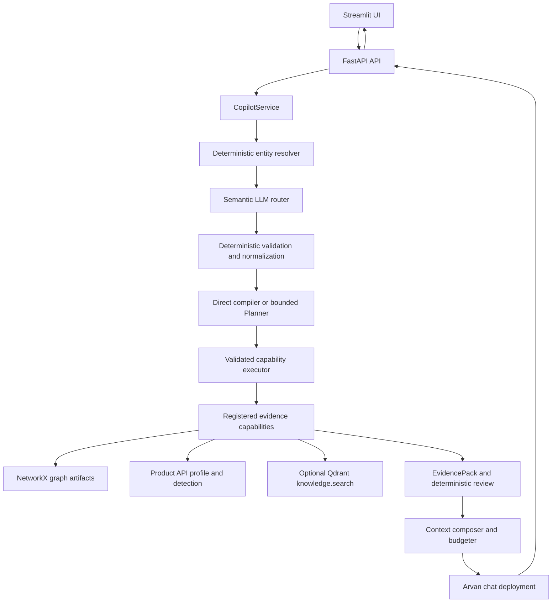

# Soorin Copilot

Soorin Copilot is a bounded cybersecurity copilot for SOC/NOC asset intelligence. The current implementation combines deterministic entity handling, an LLM-primary semantic router, operational product evidence, a NetworkX topology graph, optional SOC knowledge retrieval through Qdrant, and a Streamlit investigation workspace.

The project is intentionally conservative: current asset identity, detection, and topology evidence must come from deterministic providers; the LLM interprets, routes, and synthesizes over bounded context.

For the full audited design, implementation status, and known limitations, see [docs/CURRENT_ARCHITECTURE.md](docs/CURRENT_ARCHITECTURE.md).

## Architecture



## Phase 2 Workflow

The active request path is:

```text
Entity Resolver
-> Semantic Router and deterministic normalization
-> TaskSpec
-> deterministic direct compiler OR bounded Planner
-> PlanValidator
-> CapabilityExecutor
-> ToolResults and EvidencePack
-> deterministic Evidence Reviewer
-> optional one validated supplemental retrieval
-> reviewed Context Composer
-> Synthesizer or deterministic safe failure
-> one routing-state update
```

Four roles remain deliberately separate:

- **Planner:** proposes a structured plan only for multi-step investigations. It cannot execute tools or change entity authority.
- **Executor:** runs only validated, registered, read-only capability steps under call, depth, entity, concurrency, and timeout bounds.
- **Reviewer:** deterministically decides whether evidence is sufficient, limited, missing, or unsafe for synthesis.
- **Synthesizer:** explains reviewed evidence; it does not select providers or mutate session state.

Direct profile, detection, graph, pair/path, and knowledge requests compile deterministic plans and skip the Planner. Multi-step requests can use one Planner proposal and one schema-repair attempt only when `SOORIN_PLANNER_ENABLED=true`. The deployment remains configurable; GPT-5.5 is the currently recommended Planner deployment.

`CapabilityRegistry` is the only normal provider execution boundary. Independent Graph and Knowledge steps may overlap. Product Profile and Detection steps are serialized because they share one Product client/session. Tool outputs become canonical `ToolResult` records, including status, freshness, completeness, counts, limitations, citations, and the original typed provider result.

The first review evaluates retrieval sufficiency and may authorize one supplemental capability. Its complete final arguments are validated before execution. The second review evaluates what the Context Composer actually included after budgeting. A safe-failure decision skips the final LLM.

Workflow events use compact allowlisted metadata with request, trace, plan, and step IDs. System logs retain deployment, status, count, latency, cache, freshness, and completeness metadata without secrets, prompts, raw provider payloads, hidden reasoning, or full model responses.

Phase 2.1 adds bounded Product evidence views, request-scoped one-fetch reuse, validated Knowledge deduplication, request-specific graph completeness, conservative deployment-aware token estimates, strict offline BGE loading, optional secure evidence snapshots, and an exact greeting/thanks fast path. Detection views are `overview`, `identity_role`, `anomaly_risk`, `behavior`, and `evidence_deep`; Profile views are `overview`, `identity_role`, `services_software`, `security_posture`, and `evidence_deep`. `TaskSpec.recommended_steps` describes semantic complexity only; `PlanValidator` and configured limits remain the security boundary.

## Repository Layout

```text
app/
  app_st.py                  Streamlit workspace
  prompts/                   System and router prompts
  src/api/                   FastAPI routes and graph endpoints
  src/config/                Environment-backed settings and LLM deployments
  src/core/agent/            Typed agent contracts, registry, reviewer, bounded workflow
  src/core/context/          Entity resolution, routing, provider context, composition
  src/core/copilot/          Main request orchestration service
  src/core/graph/            NetworkX graph build, storage, refresh, retrieval, visualization
  src/core/llm/              Provider-neutral LLM client and Arvan adapter
  src/core/memory/           In-memory conversation and routing state
  src/core/observability/    Safe logging and optional evidence snapshots
  src/core/product_client/   Product API auth/client/schemas
  src/core/rag/              Qdrant-backed SOC knowledge retrieval foundation
  src/tests/                 Offline focused tests
script/
  refresh_graph.py           Manual product topology refresh
  fetch_graph_topology.py    Compatibility wrapper
docs/
  CURRENT_ARCHITECTURE.md    Authoritative audited architecture
```

Generated topology and vector-store data live under `data/` at runtime and should not be committed.

## Requirements

- Python 3.12 recommended.
- Docker with Compose for container deployment.
- Product API access only when fetching topology, profile, or detection evidence.
- Arvan/OpenAI-compatible chat-completions deployments for the router and final answer model.
- Optional Qdrant storage for SOC knowledge retrieval.
- Optional Hugging Face model cache for `BAAI/bge-base-en-v1.5` when indexing or searching RAG.

Install locally:

```bash
python -m venv .venv
source .venv/bin/activate
python -m pip install -r requirements.txt
```

## Configuration

Create local configuration files:

```bash
cp app/.env.example app/.env
cp compose.env.example compose.env
```

Then edit `app/.env`. Do not commit secrets.

Core settings:

```env
API_HOST=0.0.0.0
API_PORT=6998
SOORIN_API_BASE_URL=http://127.0.0.1:6998
STREAMLIT_SERVER_PORT=8503

SOORIN_INTENT_ROUTER_DEPLOYMENT=gpt55
SOORIN_CHAT_DEPLOYMENT=gpt55
SOORIN_PLANNER_ENABLED=false
SOORIN_PLANNER_DEPLOYMENT=gpt55
SOORIN_AGENT_MAX_CAPABILITY_CALLS=6
SOORIN_AGENT_MAX_SUPPLEMENTAL_RETRIEVALS=1
SOORIN_AGENT_EXECUTOR_MAX_CONCURRENCY=4
SOORIN_LLM_GLM_BASE_URL=
SOORIN_LLM_GLM_API_KEY=
SOORIN_LLM_GPT55_BASE_URL=
SOORIN_LLM_GPT55_API_KEY=

SOORIN_PRODUCT_API_BASE_URL=
SOORIN_PRODUCT_API_TOKEN=
SOORIN_PRODUCT_USERNAME=
SOORIN_PRODUCT_PASSWORD=
SOORIN_PRODUCT_HWID=

SOORIN_RAG_ENABLED=false
SOORIN_RAG_BACKEND=qdrant
SOORIN_RAG_QDRANT_MODE=local
SOORIN_RAG_QDRANT_URL=http://127.0.0.1:6333
SOORIN_RAG_QDRANT_PATH=data/qdrant-local
SOORIN_RAG_EMBEDDING_MODEL=BAAI/bge-base-en-v1.5
SOORIN_RAG_EMBEDDING_DIMENSION=768
SOORIN_RAG_COLLECTION=soorin_soc_knowledge_bge_base_v1
SOORIN_RAG_EMBEDDING_LOCAL_FILES_ONLY=true
SOORIN_RAG_EMBEDDING_REVISION=a5beb1e3e68b9ab74eb54cfd186867f64f240e1a
HF_HUB_OFFLINE=1
TRANSFORMERS_OFFLINE=1

SOORIN_LLM_TOKEN_ESTIMATE_MULTIPLIER=1.35
SOORIN_LOG_FORMAT=console
SOORIN_LOG_COLOR=auto
SOORIN_LOG_FILE_ENABLED=true
SOORIN_LOG_FILE_PATH=data/runtime/logs/soorin-copilot.log
SOORIN_LOG_FILE_LEVEL=INFO
SOORIN_LOG_FILE_MAX_BYTES=20971520
SOORIN_LOG_FILE_BACKUP_COUNT=10
SOORIN_HUMAN_TRACE_ENABLED=true
SOORIN_HUMAN_TRACE_DETAIL=detailed
SOORIN_EVIDENCE_SNAPSHOT_ENABLED=false
SOORIN_EVIDENCE_SNAPSHOT_MODE=summary
SOORIN_EVIDENCE_SNAPSHOT_TTL_HOURS=48
SOORIN_EVIDENCE_SNAPSHOT_MAX_REQUESTS=100
SOORIN_EVIDENCE_SNAPSHOT_MAX_TOTAL_BYTES=268435456
SOORIN_EVIDENCE_SNAPSHOT_MAX_BYTES=5242880
```

Normal `app/run.py` startup writes authoritative terminal output and, when enabled, a UTF-8 rotating runtime log. Human traces support compact `summary` and section-by-section `detailed` modes. Terminal color is TTY-aware and never reaches JSON or file logs. File rotation retains one 20 MiB active file plus 10 backups, approximately 200 MiB total. This standard-library rotation is intended for the current single-process API; future multi-worker deployments should aggregate stdout or use an external process-safe collector.

Evidence snapshots support `none`, shape-only `metadata`, safe workflow `summary`, and deeper mandatory-`redacted` modes. Summary snapshots include bounded task, plan, tool-result, review, and manifest metadata but never raw Product payloads, full model context, prompts, responses, credentials, or reasoning. Retention is bounded by 48 hours, 100 request directories, 256 MiB total, and 5 MiB per request. In Compose, API logs and evidence use the existing persistent `/workspace/data/runtime/` mount; stdout remains the container logging authority.

Use `SOORIN_RAG_QDRANT_MODE=local` with `SOORIN_RAG_QDRANT_PATH` for embedded local Qdrant storage, or `server` with `SOORIN_RAG_QDRANT_URL` for an external Qdrant server.

Planner rollout modes:

```env
# Safe parity mode (default)
SOORIN_PLANNER_ENABLED=false
```

```env
# Explicit Phase 2 Planner test mode
SOORIN_PLANNER_ENABLED=true
SOORIN_PLANNER_DEPLOYMENT=gpt55
```

Execution remains capped at six capability calls, two resolved entities, graph depth two, four executor workers, and one supplemental retrieval. The Planner always has one proposal pass; the repair setting permits at most one schema-repair call.

## Local Run

Start the API:

```bash
PYTHONPATH=app python app/run.py --api
```

Start the Streamlit workspace in another shell:

```bash
PYTHONPATH=app python app/run.py --web
```

Suggested manual checks after explicitly configuring providers:

- General knowledge question.
- Direct Profile request.
- Direct Detection request.
- Direct graph-neighbor request.
- Direct pair comparison or path request.
- Multi-step asset investigation with Planner test mode enabled.
- Multi-step relationship investigation with Planner test mode enabled.
- Partial-provider response and limitation handling.
- Persian, smart-quote, arrow, em-dash, and emoji streaming.

Default local URLs:

- API: `http://127.0.0.1:6998`
- UI: `http://127.0.0.1:8503`

## Docker Run

Build and start without changing tracked configuration:

```bash
make build
make up
make health
```

The Compose stack runs:

- `api`: FastAPI on container port `6998`, mapped to host `${SOORIN_API_PORT:-6998}`.
- `ui`: Streamlit on container port `8501`, mapped to host `${SOORIN_UI_PORT:-8503}`.

Local `app/.env` paths remain host-local. Compose overrides the corpus, local Qdrant, and Hugging Face paths for the API container. `compose.env` supplies `SOORIN_RAG_SOURCE_HOST_PATH` and `SOORIN_HF_CACHE_HOST_PATH`; both mounts are read-only, and the UI receives neither mount.

Stop while preserving volumes:

```bash
make down
```

## API

Health:

```bash
curl -fsS http://127.0.0.1:6998/health
curl -fsS http://127.0.0.1:6998/llm/health
```

Chat:

```bash
curl -fsS http://127.0.0.1:6998/chat \
  -H 'Content-Type: application/json' \
  -d '{"session_id":"demo","message":"What is Kerberos?"}'
```

Streaming chat:

```bash
curl -N http://127.0.0.1:6998/chat/stream \
  -H 'Content-Type: application/json' \
  -d '{"session_id":"demo","message":"Tell me briefly about 192.168.21.1."}'
```

Graph endpoints:

```bash
curl -fsS http://127.0.0.1:6998/graph/status
curl -fsS http://127.0.0.1:6998/graph/stats
curl -fsS http://127.0.0.1:6998/graph/nodes/192.168.21.1
curl -fsS 'http://127.0.0.1:6998/graph/nodes/192.168.21.1/neighbors?direction=both&limit=20'
curl -fsS 'http://127.0.0.1:6998/graph/path?source=192.168.21.1&target=192.168.21.10'
```

## Graph Refresh

Manual topology refresh calls the configured Product API and writes graph artifacts:

```bash
PYTHONPATH=app python script/refresh_graph.py
```

`script/fetch_graph_topology.py` is a compatibility wrapper around the same refresh command.

At API startup, the service loads the last-known-good graph artifact first. If graph auto-refresh is enabled, a background refresh loop can fetch, validate, persist, and atomically activate newer product topology snapshots.

## RAG Indexing

The SOC knowledge corpus should normally be mounted or referenced outside this repository through `SOORIN_RAG_SOURCE_ROOT`.

Validate the corpus without embeddings or writes:

```bash
PYTHONPATH=app python -m src.core.rag.indexer
```

Build or update the Qdrant index only when you explicitly intend to load the embedding model, generate embeddings, and write records:

```bash
PYTHONPATH=app SOORIN_RAG_ENABLED=true python -m src.core.rag.indexer --build
```

Current default embedding model:

```text
BAAI/bge-base-en-v1.5, dimension 768
```

Legacy SecureBERT collections are rejected by configuration validation to avoid silently reusing incompatible vectors.

## Tests

Focused tests:

```bash
PYTHONPATH=app python -m pytest app/src/tests/test_agentic_rag_foundation.py -q
PYTHONPATH=app python -m pytest app/src/tests/test_chat_streaming.py -q
PYTHONPATH=app python -m pytest app/src/tests/test_phase2_agent_workflow.py -q
PYTHONPATH=app python -m unittest app.src.tests.test_context_routing -v
```

Compile:

```bash
PYTHONPATH=app python -m compileall -q app
```

## Limits

- The graph is an observed communication graph, not proof of physical routing, trust, compromise, or reachability.
- Product profile and detection providers return current product evidence when configured; failures are surfaced as unavailable or stale fallback, not verified facts.
- RAG is optional and documentation-oriented. It is not source of truth for current assets, detections, graph edges, alerts, risk values, or peer lists.
- Direct requests use deterministic plans and never pay Planner overhead. Multi-step investigations may use one structured Planner pass, but every plan is deterministically validated and limited to six registered read-only calls, two entities, graph depth two, and one reviewer-approved supplemental retrieval.
- The active synthesis path consumes a reviewed canonical EvidencePack. Provider failures, omissions, freshness, truncation, graph coverage, and RAG citations remain explicit.
- LangGraph currently provides bounded dispatch, typed state transport, stage visibility, and recursion control; detailed orchestration remains in `CopilotService`.
- Already-running synchronous provider calls cannot be forcibly terminated after an executor timeout; provider-native timeouts remain the primary transport bound.
- Neo4j, SIEM actions, MCP, remediation, durable checkpoints, and long-term memory are deferred.
- Conversation and routing state are in-memory per process.
- Streaming preserves Unicode over SSE; clients should parse UTF-8 SSE events instead of re-decoding text manually.
