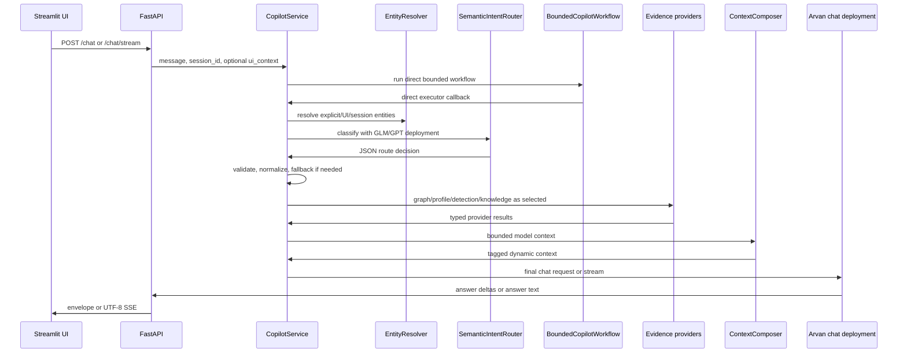

# Soorin Copilot Current Architecture

Audit date: 2026-07-18.

This document describes the implemented repository state. It distinguishes working behavior from partial foundations, placeholders, and deferred work. It should be updated after architecture-changing code changes.

## 1. Architecture Principles

Soorin Copilot follows these implementation rules:

- Deterministic systems own entity identity, provider selection validation, graph retrieval, product evidence retrieval, context budgeting, state updates, and fallback safety.
- The LLM is the primary semantic router and final synthesis engine, but it does not invent operational evidence.
- Current operational evidence outranks previous assistant prose and retrieved documentation.
- Explicit user entities outrank UI-selected entities, which outrank active session entities.
- Detached general questions must not inherit stale asset context.
- Provider failures are represented as unavailable, partial, stale, or safe failure; they are not converted into verified facts.
- Graph evidence is topology evidence only. It does not prove physical routing, trust, dependency, compromise, or reachability.
- RAG evidence is documentation evidence only. It does not override current product or graph evidence.

## 2. High-Level Runtime Flow



## 3. API Layer

Implemented in `app/src/api`.

Routes:

- `GET /health`: returns `{"status": "ok"}`.
- `GET /llm/health`: returns configuration/provider readiness only; no expensive generation call.
- `POST /chat`: non-streaming chat envelope.
- `POST /chat/stream`: final-answer SSE stream.
- `GET /graph/status`: active graph status and refresh metadata.
- `GET /graph/stats`: graph statistics.
- `GET /graph/nodes/{ip}`: single-node degree lookup.
- `GET /graph/nodes/{ip}/neighbors`: bounded direct neighbors.
- `GET /graph/nodes/{ip}/context`: deterministic context digest.
- `GET /graph/path`: shortest path in the observed directed communication graph.

`app/src/api/main.py` creates one FastAPI app, includes chat and graph routers, validates selected LLM deployments on startup, loads the last-known-good graph artifact, and starts the graph refresh scheduler.

Current API compatibility:

- `/chat` keeps the existing envelope shape.
- `/chat/stream` preserves the existing SSE event schema and adds UTF-8 charset.
- There are graph read endpoints, but no RAG endpoint and no planner endpoint.

## 4. Configuration

Implemented in `app/src/config/settings.py`.

Settings are loaded from `app/.env` if present, then from environment variables. The local `.env` file is intentionally not tracked. Sensitive values are represented in logs only as configured/not configured booleans.

Major groups:

- API/UI: `API_HOST`, `API_PORT`, `API_RELOAD`, `SOORIN_API_BASE_URL`, `SOORIN_API_TIMEOUT_SECONDS`, `STREAMLIT_SERVER_PORT`.
- LLM: selected router/chat deployments plus per-deployment Arvan base URL, model, API key, timeouts, token limits, and sampling support.
- Product API: base URL, topology path, profile path, detection path, login path, token, login credentials, captcha bypass, HWID, retry and timeout settings.
- Graph: artifact paths, UI limits, API limits, retrieval limits, context limits, refresh policy, validation thresholds.
- RAG: enabled flag, source root, backend, Qdrant mode/server URL/local path, collection, score threshold, BGE embedding model and dimension, chunking and upsert limits.
- Prompts and router: system prompt path, router prompt path, confidence threshold, repair retry flag.
- Conversation: history storage and deterministic summary limits.

Validation currently enforces:

- Selected enabled LLM deployments must have base URLs.
- Product profile path must contain exactly one safe `{ip}` placeholder.
- RAG Qdrant local mode requires a path.
- RAG Qdrant server mode requires a URL.
- BGE default dimension must be 768.
- Legacy SecureBERT model and collection values are rejected when RAG is enabled.

## 5. LLM Deployments

Implemented in `app/src/config/llm_deployments.py`, `app/src/core/llm/client.py`, and `app/src/core/llm/providers/arvan.py`.

The system supports two named Arvan-compatible deployments:

- `glm`, default model label `GLM-5.2`.
- `gpt55`, default model label `GPT-5.5`.

`SOORIN_INTENT_ROUTER_DEPLOYMENT` selects the semantic router model. `SOORIN_CHAT_DEPLOYMENT` selects the final synthesis model. Both aliases use the same typed `ArvanDeploymentConfig` contract.

The provider:

- Calls `{base_url}{chat_path}`.
- Sends OpenAI-compatible `messages`.
- Uses `Authorization: <auth_scheme> <api_key>`.
- Extracts `choices[0].message.content`.
- Detects `reasoning_content` without logging or exposing it unless explicit reasoning exposure is enabled.
- Logs compact metadata: purpose, deployment, model, host, status, latency, usage, output size, and reasoning presence.
- Does not log API keys, Authorization headers, raw responses, or hidden reasoning.

Retry behavior:

- Router calls are not retried through the generic transient retry loop.
- Final chat calls can retry transient provider failures up to configured limits.
- Streaming is available only for final chat purpose.

## 6. Entity Resolution and Authority

Implemented in `app/src/core/context/entities.py`.

Entity extraction is deterministic and currently focused on IPv4 addresses and CIDR constraints.

Authority order:

```text
explicit IP in current message > selected UI IP > active session IP/entities
```

Supported behavior:

- Explicit single IP creates a message-sourced entity.
- Explicit pair creates a message-sourced pair for relationship, comparison, and path routes.
- UI-selected IP is used only when no valid explicit message entity exists.
- Active session IP supports follow-ups such as "its data", "its connections", "tell me more about it".
- Active pair supports pair follow-ups such as "compare them".
- Topic detachment suppresses stale active/UI context for general conceptual questions.
- Explicit new IP overrides previous active IP and UI selection.

The router classifies intent only. It does not invent entities; it can choose which already-resolved binding should be used.

## 7. Semantic Routing

Implemented in `app/src/core/context/intent.py` and `app/src/core/context/router.py`.

Normal routing path:

```text
deterministic entity extraction
-> semantic LLM router
-> strict schema validation
-> deterministic normalization
-> deterministic fallback only on provider/schema/confidence failure
```

The external router prompt is in `app/prompts/intent_router_system_prompt.md`. A compact fallback router prompt exists in code if the file is missing.

Validated router fields include:

- intent
- scope
- direction
- depth
- requires_graph
- requires_detection
- requires_asset_profile
- requires_knowledge
- entity_binding
- requires_multiple_entities
- is_followup
- classification_confidence
- reason

Important normalization rules:

- Single-asset `node_summary` always requires graph context.
- Graph scopes require graph context.
- General or unclear turns bind no stale entity.
- Explicit entities override UI binding.
- UI binding applies only when no explicit entity exists.
- Exhaustive direct-neighbor wording maps to `full_neighbors`.
- Path requires two entities and graph context.

Deterministic fallback is present but intentionally secondary. Its operational provider logging currently covers graph, detection, and asset profile; semantic routes can also select knowledge.

## 8. Agentic Foundation

Implemented in `app/src/core/agent`.

Current status: partial foundation, direct bounded workflow active, full planner deferred.

Contracts:

- `InvestigationState`
- `TaskSpec`
- `ExecutionPlan`
- `PlanStep`
- `ToolResult`
- `EvidenceFact`
- `EvidencePack`
- `ReviewDecision`
- `CapabilitySpec`

Capability registry entries:

- `asset.get_profile`
- `asset.get_detection`
- `graph.get_summary`
- `graph.get_neighbors`
- `graph.get_relationship`
- `graph.compare_assets`
- `graph.find_path`
- `knowledge.search`

Current workflow:

- `BoundedCopilotWorkflow` uses LangGraph `StateGraph` when installed.
- If LangGraph is unavailable, it uses a deterministic compatibility runner.
- Nodes are `resolve`, `route`, `validate_task`, `select_workflow`, `execute_direct`, `build_evidence`, `review_evidence`, and `synthesize`.
- Recursion limit is 12.
- The actual current request path is still the direct `CopilotService._chat_direct` executor.
- No unrestricted tool loop exists.
- No LLM planner exists.
- Multi-step task classification creates a bounded placeholder plan only.
- The deterministic evidence reviewer exists, but current active synthesis still relies on provider-specific context composition inside the direct executor rather than a full agent evidence-pack pipeline.

## 9. Evidence Reviewer

Implemented in `app/src/core/agent/reviewer.py`.

Current status: deterministic reviewer implemented, partially integrated structurally.

Checks include:

- Required capability present.
- Required entity cardinality present.
- Provider status.
- Stale or unknown freshness.
- Completeness.
- Truncation.
- Context inclusion.
- Contradictions.
- Limitations.
- RAG configured/available state through `ToolResult` status and limitations.

Outcomes:

- `sufficient`
- `answer_with_limitations`
- `missing_required_evidence`
- `safe_failure`

There is no LLM evidence reviewer.

## 10. Product API Integration

Implemented in `app/src/core/product_client` and product-backed context providers.

Product client behavior:

- Uses `requests.Session` with retry adapter.
- Sends bearer token and HWID headers.
- Normalizes configured bearer tokens so operators may provide either raw token or `Bearer <token>`.
- Can bootstrap from `SOORIN_PRODUCT_API_TOKEN`.
- Can login through `SOORIN_PRODUCT_LOGIN_PATH` when credentials are configured.
- On 401, invalidates token, retries once after refresh/login, then returns a safe unauthorized error.
- Logs auth source, token age, refresh status, retry count, status code, and latency without logging tokens, passwords, captcha bypass values, or Authorization headers.

Product endpoints:

- Topology: `SOORIN_PRODUCT_TOPOLOGY_PATH`, default `/zeek/connections/unique-ip-pairs`.
- Detection: `SOORIN_PRODUCT_ASSET_DETECTION_PATH`, default `/asset-detection/test/{ip}`.
- Asset profile: `SOORIN_PRODUCT_ASSET_PROFILE_PATH`, default `/profile/{ip}`.
- Login: `SOORIN_PRODUCT_LOGIN_PATH`, default `/auth/login`.

Detection and profile providers:

- Fetch full JSON without reshaping product fields.
- Cache by normalized IP using the detection cache settings.
- Can return stale cached evidence on provider error if configured.
- Track raw JSON size, approximate tokens, top-level key counts, cache hit/miss/stale status, HTTP status, and safe error classification.

## 11. Graph Topology

Implemented in `app/src/core/graph`.

Graph source:

- Product topology unique IP pairs.
- Parsed into `TopologyConnectionRecord`.
- Built as a directed `networkx.DiGraph`.
- Edge `src_ip -> dst_ip` means an observed unique communication pair.
- Duplicate records increase edge weight.

Artifacts:

- Raw JSON: `SOORIN_GRAPH_RAW_PATH`.
- Pickle graph: `SOORIN_GRAPH_PICKLE_PATH`.
- Stats JSON: `SOORIN_GRAPH_STATS_PATH`.
- Optional GraphML: `SOORIN_GRAPH_GRAPHML_PATH`.
- Optional GEXF: `SOORIN_GRAPH_GEXF_PATH`.

Startup and refresh:

- API startup loads the last-known-good pickle if available.
- Background refresh is controlled by `SOORIN_GRAPH_AUTO_REFRESH_ENABLED`, `SOORIN_GRAPH_REFRESH_ON_STARTUP`, interval, jitter, failure, and validation settings.
- Refresh fetches topology, validates minimum nodes/edges and drop ratios, writes artifacts atomically, writes snapshots, prunes old snapshots, and atomically replaces the active in-memory graph.
- Failed refresh preserves the previous active graph.

Retrieval scopes:

- `node_summary`: summary of one node; context metadata reports only included summary context, not peer entries.
- `one_hop`: direct peers.
- `full_neighbors`: exhaustive direct-neighbor retrieval within configured limits.
- `two_hop`: neighbors of neighbors within configured limits.
- `multi_entity_comparison`: pair comparison and shared peers.
- `path`: shortest observed communication-graph path.

Graph limitations are always attached to Copilot graph context.

## 12. Graph API and Visualization

Graph API endpoints are read-only and deterministic. They use the active in-memory graph or the configured graph artifact.

The Streamlit topology page:

- Renders an interactive PyVis/vis-network graph.
- Supports max-node, minimum-degree, subnet, and physics-mode filters.
- Uses canonical CIDR subnet labels and filters with `ipaddress.ip_network(..., strict=False)`.
- Skips non-IP nodes safely.
- Keeps tab output scoped to the proper Streamlit tab.
- Supports node-click selection for Copilot UI context.
- Clears node selection when the graph canvas background is clicked.
- Preserves zooming, dragging, node details, shortest path lookup, IP exploration, and all nodes views.

The visualization uses explicit vis-network physics options, stable random seed, and a default "stabilize once, then freeze" mode.

## 13. RAG and Knowledge Search

Implemented in `app/src/core/rag`.

Current status: optional foundation implemented; indexing is explicit; no startup indexing.

Responsibilities:

- `sources.py`: source root validation, source discovery, document loading.
- `chunker.py`: deterministic chunking with stable chunk metadata.
- `embeddings.py`: lazy Hugging Face embedder behind `Embedder` protocol.
- `vector_store.py`: Soorin-owned vector-store protocol.
- `qdrant_store.py`: Qdrant implementation behind the vector-store protocol.
- `service.py`: `knowledge.search` orchestration.
- `citations.py`: citation creation.
- `safety.py`: prompt-injection filtering on retrieved chunks.
- `indexer.py`: explicit validation/indexing entry point.

Default model:

- `BAAI/bge-base-en-v1.5`
- dimension `768`
- attention-mask-aware mean pooling
- L2 normalization
- identical document and query embedding pipelines
- lazy loading on first real embedding call

Qdrant:

- Primary vector backend.
- Supports `server` mode with URL/API key and `local` mode with a local path.
- Validates collection dimension and distance.
- Supports stable IDs, payload metadata, simple payload filters, batched upsert, delete, health, and collection info.
- Does not launch a Qdrant server by itself.

Knowledge statuses:

- `ok`
- `empty`
- `not_configured`
- `unavailable`
- `invalid`
- `partial`

RAG is appropriate for SOC runbooks, NDR documentation, MITRE/protocol explanations, hardening guidance, investigation procedures, and approved product documentation. It is not source of truth for current asset identity, current graph relationships, live detections, current alerts, risk values, or exact current peer lists.

## 14. Context Composition and Budgeting

Implemented in `app/src/core/context/composer.py`.

The context composer produces a dynamic system message with:

- Provider coverage manifest.
- Tagged asset profile JSON.
- Tagged asset detection JSON.
- Tagged graph JSON.
- Tagged knowledge JSON and citations when selected and budget permits.
- Source semantics and limitations.
- Explicit warning that operational evidence outranks documentation.

Budget controls:

- Uses configured context window, reserved output tokens, safety margin, and base input token estimate.
- Graph exhaustive requests allocate graph context before narrative product detail.
- Product payloads can be compacted when exhaustive graph context needs priority.
- Required graph context that cannot fit creates a safe context limitation.
- Knowledge context participates in the same budget and may be omitted with logged reason.

Conversation history is trimmed to fit budget, preferring current evidence over old assistant claims.

## 15. Conversation and Routing State

Implemented in `app/src/core/memory`.

Current state is in-memory per process.

Conversation memory:

- Stores user and assistant messages when enabled.
- Truncates to configured maximum messages.
- Builds deterministic compact summaries when token thresholds are exceeded.
- Does not use an LLM for summaries.

Routing state:

- Stores active IP, active entity pair, previous intent, previous scope, previous direction, previous depth, and previous operational provider state.
- Successful single-IP graph requests preserve active IP and node-summary route state.
- General or unclear detached turns do not erase active IP.
- Knowledge-only routes can be selected and included in trace/provider status, but current persisted `last_provider`/`last_providers` are operational-provider oriented and do not persist `knowledge` as a last provider.

## 16. Streaming and Unicode

Streaming path:

- Arvan provider reads upstream SSE with `iter_lines(..., decode_unicode=True)` and UTF-8 response encoding.
- Provider emits typed `LLMStreamEvent` objects.
- API serializes SSE data with `json.dumps(..., ensure_ascii=False)`.
- API returns `StreamingResponse(..., media_type="text/event-stream; charset=utf-8")`.
- Streamlit uses `parse_sse_events` with an incremental UTF-8 decoder for byte chunks.

Covered Unicode cases:

- Smart double quotes.
- Smart single quotes.
- Em dash.
- Arrow.
- Persian text.
- Emoji.
- Split UTF-8 transport chunks.

Non-streaming chat remains unchanged and preserves Unicode text.

## 17. Streamlit UI

Implemented in `app/app_st.py` and `app/src/web`.

Current UI:

- Unified investigation workspace with sidebar logo.
- Sidebar status includes backend readiness, dynamic active LLM model from `/llm/health` with settings fallback, graph loaded status and node count, and selected topology target.
- Chat area uses `st.chat_message` and `st.chat_input`.
- Chat input is rendered after existing messages.
- Final answer streaming updates one assistant message and stores it once.
- UI context includes selected graph IP only when one is selected.
- Help content explains asset authority, evidence sources, example prompts, and precision tips.
- Topology page is embedded beside the chat area.

Current known UI wording issue:

- The main chat description still contains legacy wording that says asset, RAG, and graph context will be added later, even though graph/product evidence and optional RAG foundations are now implemented. This is documentation-only audit information; no UI code was changed by this document update.

## 18. Deployment

Local launcher:

- `python app/run.py --api`
- `python app/run.py --web`

Docker:

- `Dockerfile` builds wheels in a builder stage and runs as non-root `soorin`.
- Runtime copies `app`, `lib`, `script`, and `docs`.
- Runtime exposes `6998` and `8501`.
- `compose.yaml` defines `api` and `ui` services.
- API uses `python app/run.py --api`.
- UI uses `python -m streamlit run app/app_st.py --server.port=8501`.
- Host port defaults are API `6998` and UI `8503`.
- Volumes:
  - `copilot-data` for graph/runtime data.
  - `copilot-qdrant` for local Qdrant path.
  - `copilot-cache` for Hugging Face cache.

Compose currently does not define a separate Qdrant server container. Use local Qdrant mode for embedded file-backed Qdrant storage, or configure an external Qdrant server URL.

## 19. Tests

Current focused tests:

- `test_agentic_rag_foundation.py`: contracts, registry, fake embedder/vector store, Qdrant config/unavailable state, knowledge.search states, task mapping, reviewer, RAG context.
- `test_chat_streaming.py`: provider streaming, SSE contract, UTF-8, non-streaming preservation, UI contract checks.
- `test_context_budget_allocation.py`: context budget and graph/product/knowledge inclusion behavior.
- `test_context_routing.py`: semantic/fallback routing, entity authority, active single/pair follow-ups, graph scopes, UI authority, subnet formatting, topology UI helpers.
- `test_detection_integration.py`: product JSON provider and detection/profile behavior.
- `test_detection_phase12.py`: additional detection/profile/cache/context protections.
- `test_llm_deployments.py`: multi-deployment settings and LLM health.
- `test_llm_retry.py`: transient retry and non-retry behavior.

Common commands:

```bash
PYTHONPATH=app python -m compileall -q app
PYTHONPATH=app python -m pytest app/src/tests/test_agentic_rag_foundation.py -q
PYTHONPATH=app python -m pytest app/src/tests/test_chat_streaming.py -q
PYTHONPATH=app python -m unittest app.src.tests.test_context_routing -v
PYTHONPATH=app python -m unittest discover -s app/src/tests -p "test_*.py" -v
git diff --check
```

Live Product API, Arvan, embedding downloads, Qdrant server, graph refresh, and indexing should be tested only deliberately, never as default offline verification.

## 20. Implemented, Partial, Deferred

Implemented:

- FastAPI chat and graph APIs.
- Streamlit workspace with topology UI and streaming chat.
- Provider-neutral LLM client with Arvan deployments for GLM/GPT aliases.
- Semantic LLM router with deterministic validation and fallback.
- Deterministic IPv4 entity authority.
- Product auth/client for topology, detection, profile, and login.
- NetworkX graph build, storage, refresh, retrieval, and visualization.
- Optional Qdrant-backed RAG foundation.
- BGE embedding configuration and lazy Hugging Face embedder.
- Context composer with provider coverage, budgets, and limitations.
- In-memory conversation and routing state.
- UTF-8-safe SSE streaming.
- Bounded typed agent contracts, registry, task mapping, and reviewer foundation.

Partial or structural:

- LangGraph workflow currently wraps the existing direct request path.
- Multi-step plan is a bounded placeholder, not an autonomous planner.
- Evidence reviewer exists but does not yet drive a full pre-synthesis evidence-pack control loop in the active direct path.
- Capability registry wraps current providers but active Copilot execution still calls providers directly.
- RAG has service and indexer support, but no dedicated public API endpoint and no automatic index build.

Deferred or not implemented:

- Full LLM planner.
- LLM evidence reviewer.
- Neo4j, Cypher, text-to-Cypher, Graph Data Science.
- MCP.
- SIEM/Splunk integrations.
- Alert actions.
- Report-generation endpoints.
- Long-term durable memory.
- Database-backed checkpoints.
- Human approval workflows.
- Automatic remediation.
- Microsoft Global or DRIFT GraphRAG.
