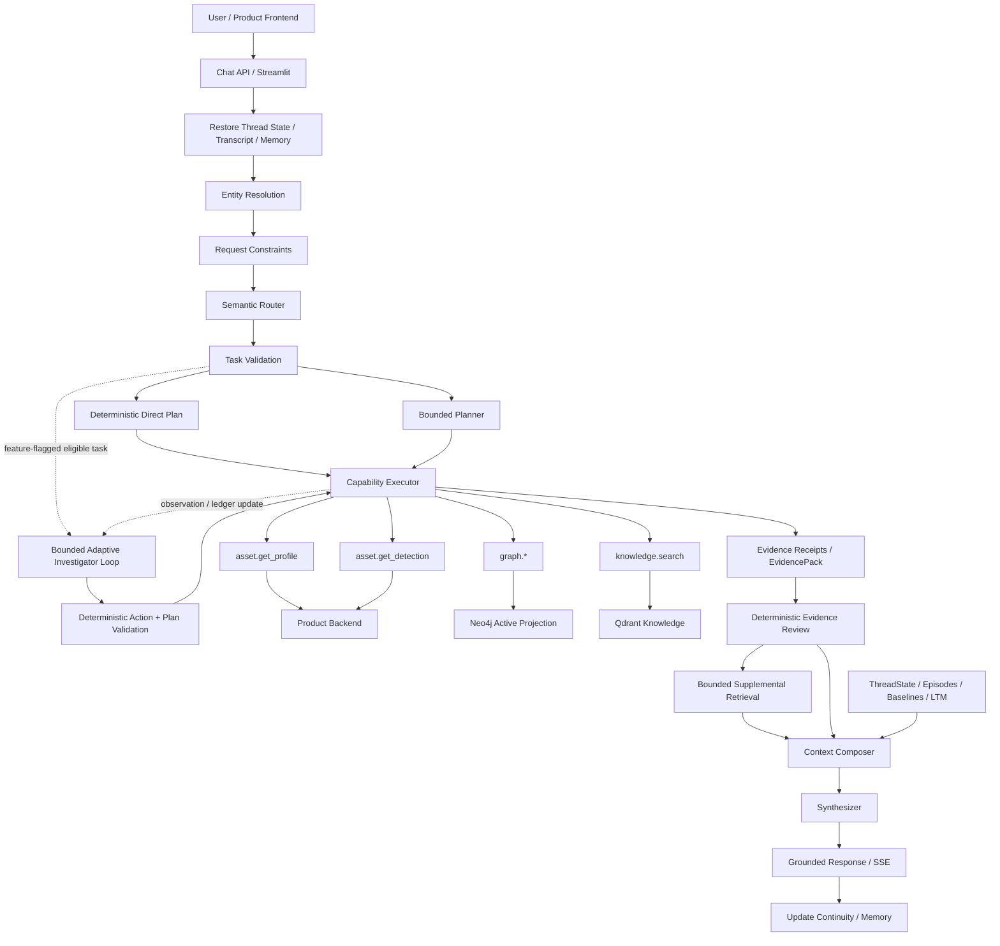

# Soorin Copilot Current Architecture

This document describes the current production architecture of Soorin Cyber Copilot. It is the canonical technical reference for the runtime request path, evidence model, graph integration, memory, LLM roles, and service boundaries.

## System Overview

Soorin Copilot is a bounded, evidence-aware cybersecurity assistant for SOC, NOC, NDR, threat-intelligence, and asset-intelligence workflows. It correlates four principal sources:

- live Product Backend evidence for Asset Profile and Detection;
- a versioned Neo4j organizational and communication-topology projection;
- approved cybersecurity knowledge retrieved from Qdrant;
- bounded conversation, investigation, and long-term memory.

LLMs interpret and synthesize, while deterministic application logic controls entity binding, tool access, evidence requirements, execution limits, context budgets, and persistence.

## End-to-End Request Flow



## Workflow Stages

### 1. Restore continuity

For an authorized conversation, the service restores available ThreadState, active entity or pair state, structured-query continuity, working facts, recent turns and summaries, investigation episodes, baselines, and eligible long-term memory. Product-backed transcript and Product Thread-State are separate data sources and are restored independently.

### 2. Resolve entities and constraints

The entity-resolution layer interprets explicit message entities, UI-selected asset context, active investigation state, and bounded references from conversation state. Request constraints identify requirements such as current/live evidence, pure memory recall, explicit memory writes, graph scope, comparison scope, or structured asset-set discovery.

### 3. Semantic routing

The Router produces typed intent and scope. Structured asset requests can include typed search or aggregation semantics. Application validation remains authoritative and can use deterministic fallback behavior when model routing is unavailable or invalid.

### 4. Planning

The validated task is assigned a deterministic orchestration mode. Simple requests use a direct plan. More complex supported requests may use one bounded Planner proposal in `fixed` mode. When `SOORIN_ADAPTIVE_AGENT_ENABLED=true`, eligible investigations whose next action depends on previous evidence can instead enter the bounded adaptive loop. The flag defaults off, and simple/no-live/memory-only requests remain direct.

In adaptive mode, the Investigator proposes one strict typed decision at a time. Deterministic code validates capability, evidence-gap, entity, temporal, Graph, request-constraint, repetition, and budget authority; compiles the action to an `ExecutionPlan`; runs the existing `PlanValidator`; fingerprints the normalized action; suppresses only proven equivalent/repeated work; and executes new work through the existing `CapabilityExecutor`. See [AUTONOMOUS_AGENT_WORKFLOW.md](AUTONOMOUS_AGENT_WORKFLOW.md).

Patch D adds an offline evaluation plane, not another production route. Deterministic replay and opt-in real-Investigator shadow replay use synthetic `ToolResult` fixtures after the production validators; they have no capability executor or memory writer. Passing replay advances only to model-replay readiness, and passing model replay advances only to staging readiness. See [AUTONOMOUS_AGENT_EVALUATION.md](AUTONOMOUS_AGENT_EVALUATION.md).

### 5. Capability execution

The capability registry exposes only approved read-only operations. Current capabilities are:

- `asset.get_profile`
- `asset.get_detection`
- `graph.get_summary`
- `graph.get_neighbors`
- `graph.get_relationship`
- `graph.compare_assets`
- `graph.find_path`
- `graph.search_assets`
- `graph.aggregate_assets`
- `knowledge.search`

The executor enforces configured limits for entities, graph depth, capability count, concurrency, and request duration.

### 6. Structured discovery and focal deepening

Structured asset discovery uses typed Neo4j search/aggregate contracts rather than arbitrary Cypher. Search results remain an Asset set. When the request also requires deeper analysis and a focal asset can be chosen deterministically, the workflow can deepen the selected asset through Product Profile, Detection, and Graph capabilities.

```text
Structured discovery
→ bounded Asset set
→ deterministic focal selection when unambiguous
→ Product Profile / Detection
→ Graph topology
→ unified evidence
```

Ambiguous multi-result searches remain set-level rather than triggering unbounded per-asset Product fan-out.

### 7. Evidence normalization and review

Each tool result is normalized into evidence metadata that includes source capability, entity binding, freshness, completeness, truncation, retrieval time, and safe limitations. The Evidence Reviewer evaluates whether the request's required evidence is satisfied before synthesis. A bounded supplemental retrieval may be attempted when configured and useful on direct/fixed paths. In adaptive mode, each immutable result also produces a bounded request-local `EvidenceReference`: context identity identifies its scope, while a versioned semantic fingerprint identifies normalized content independently of operational metadata. The deterministic, temporally aware Evidence Ledger owns gap state and the Investigator proposes the next action; the Reviewer does not select tools.

Graph evidence is reusable only for its observed active projection version. If a later Graph result exposes a version switch within the request, prior-version references remain evidence for final synthesis but lose reuse/coverage authority; affected Graph gaps reopen and can be retrieved against the new active version.

### 8. Context composition

The Context Composer receives validated Product, Graph, Knowledge, and memory context. It applies configured per-source budgets plus the global LLM context window, reserved output, safety margin, and token-estimate multiplier. Structured asset search and aggregate serialization have their own model-facing token limits and row/group bounds.

Adaptive decisions use a separate compact state builder, not final Synth context. Each Investigator turn preserves task/request authority, authorized entities/candidates, unresolved gaps, budget, relevant capability schemas, a bounded evidence-reference index, and only the latest observation delta. It excludes raw provider payloads and prior Investigator transcripts. Deterministic compaction records before/after token estimates and fails safely if mandatory authority exceeds the hard limit.

### 9. Synthesis

The Synthesizer receives the bounded evidence package and authorized memory context. It produces the analyst-facing answer while source authority remains explicit: current Product evidence is current operational truth, Neo4j is organizational/topology projection, Qdrant is reference knowledge, and memory is continuity/historical context.

### 10. Memory update

After synthesis, the workflow updates eligible working facts, recent-turn state, episodes, baselines, StructuredQueryContext, typed long-term-memory candidates/findings, active investigation continuity, and Product-backed Thread-State when configured.

## Evidence Authority

### Product Backend

Product is authoritative for current/deep Asset Profile and Detection data. Copilot obtains these through the shared authenticated Product client, including login/token refresh and configured HWID/user scoping.

### Neo4j

Neo4j is the active organizational and topology projection used for structured discovery and graph reasoning. Product remains the source from which topology and enrichment are synchronized.

### Knowledge RAG

Knowledge retrieval uses Qdrant and the configured embedding model. RAG supplies cybersecurity background and approved reference material, not live asset state.

### Memory

Memory provides conversational continuity, historical findings, and investigation state. Fresh operational evidence is retrieved when the task requires current truth.

## Graph Architecture

The graph service uses Neo4j Community 2026.07.1. Product topology is synchronized into versioned projections; queries read only the currently published active version. Refresh failures preserve the previous good projection.

The graph layer supports:

- asset/node summary;
- directional and full-neighbor analysis;
- direct relationship checks;
- bounded path search;
- two-asset topology comparison;
- typed asset search;
- typed count/group aggregation.

Structured selectors and group fields are allow-listed. The user and LLM are not given a raw-Cypher execution surface.

## Asset Enrichment

The enrichment runtime can periodically retrieve Product detection-overview information and project approved identity/classification fields into Neo4j. Enrichment is bounded by page size, pages per cycle, concurrency, refresh/retry eligibility, leases, startup delay, and shutdown limits.

## Memory Architecture

The memory subsystem includes:

- active entity and pair routing state;
- durable ThreadState;
- explicit working facts;
- recent raw messages and summaries/digests;
- investigation episodes;
- baseline projections and delta continuity;
- `StructuredQueryContext` for bounded result-set lineage;
- typed long-term memory with Product or local reference backends;
- optional Qdrant vector indexing for memory retrieval.

Product Thread-State uses the Product wire contract while internal Copilot memory schema can evolve independently inside the opaque state document.

## LLM Architecture

Four roles are configured independently:

- Router
- Planner
- Investigator
- Synthesizer

The transport is OpenAI-compatible. Supported provider policies are:

- `arvan`
- `vllm`
- `ollama`
- `openai_compatible`

Arvan uses its API-key requirement. Private compatible endpoints may be configured without an API key. Base URL, model, API key, token limits, timeout, and sampling support are role-specific; Router and Planner also retain their repair budgets. The Investigator deployment is constructed only when adaptive mode is enabled and may explicitly point to the same physical endpoint/model as another role. The provider type is selected globally for the current deployment.

## RAG Architecture

The normal runtime uses local Qdrant storage at the configured path and a Hugging Face embedding model loaded from local cache. The Docker deployment mounts the Hugging Face cache read-only and keeps model files outside the image. Index construction/maintenance is separate from normal chat-time retrieval.

## API, Streaming, and Authentication

FastAPI exposes public health and protected Copilot/graph functionality. Chat output uses UTF-8 server-sent events. The Copilot API accepts the configured dedicated Copilot API-key header and compatible Bearer authentication. Product Backend calls use the Product authentication workflow independently.

The Streamlit UI runs as a separate container/process and calls the API through the configured base URL. In Compose, it uses service DNS `http://api:6998`.

## Observability

Application observability includes:

- console or JSON logging;
- rotating file logs;
- request and trace identifiers;
- workflow-node and capability telemetry;
- bounded adaptive-loop outcomes, budgets, actions, and stop reasons;
- adaptive evidence-reference changes, equivalent-action suppression, material progress, and context savings;
- workflow-mode latency, adaptive logical LLM/capability calls per request, and bounded invalid-proposal counters;
- provider latency/token metadata;
- human-readable detailed traces, including safe adaptive lifecycle summaries;
- optional bounded evidence snapshots;
- Prometheus metrics;
- Loki/Alloy log collection;
- Grafana dashboards.

The provisioned dashboard contains a compact Adaptive Investigator readiness row. Evaluation JSON is a separate release artifact and is never rendered into normal request traces.

## Deployment Boundaries

The production Docker image contains application code and Python dependencies, not private configuration, Qdrant data, model caches, or runtime logs. The API runs as the non-root `soorin` user.

Persistent resources are supplied externally through repository/runtime data, host cache mounts, and named Docker volumes. See [DEPLOYMENT.md](DEPLOYMENT.md) for the current deployment contract and [ENVIRONMENT_VARIABLES.md](ENVIRONMENT_VARIABLES.md) for configuration.

Adaptive state uses serializable typed values, but the monotonic request deadline is process-local. Checkpoint persistence and adaptive restart/resume remain disabled.
