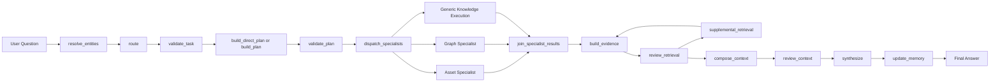
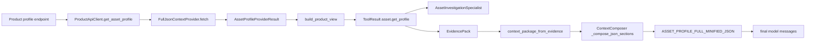
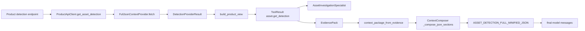
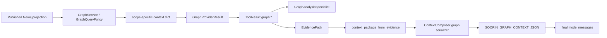
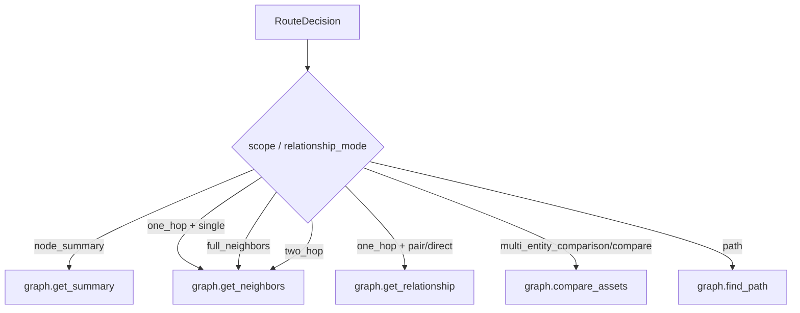

# Internal Evidence To Model Context Audit

> **Gate 8 update:** This audit originally captured the pre-Gate-8 full-minified
> Product contract. Claims below that Product views are metadata-only, that full
> Profile/Detection JSON is the default model representation, or that long-term
> memory can never suppress a call are historical findings. Current code retains
> canonical payloads internally, retrieves four compact Detection views plus
> deep `full`, projects the current full Profile into six approved views, applies
> deterministic memory sufficiency and evidence gaps, reserves Graph budget,
> deduplicates exact equivalent facts, and permits delta only with an accessible
> compatible baseline. Current tags are `ASSET_PROFILE_CONTEXT_JSON` and
> `ASSET_DETECTION_CONTEXT_JSON`; full JSON reaches synthesis only through a
> validated `full` view.

## 1. Executive Summary

This audit traces how Soorin Copilot evidence moves from internal providers into the final synthesis-model messages on branch `dev`.

Audited domains:

| Domain | Capabilities |
| --- | --- |
| Asset Profile | `asset.get_profile` |
| Asset Detection | `asset.get_detection` |
| Graph | `graph.get_summary`, `graph.get_neighbors`, `graph.get_relationship`, `graph.compare_assets`, `graph.find_path` |
| Knowledge/RAG | `knowledge.search` |

Main finding: successful provider execution does not automatically prove model-visible inclusion. The final authority point is `ContextComposer.compose()` plus `apply_context_inclusion()`.

High-priority findings:

| Priority | Finding | Summary |
| --- | --- | --- |
| P0 | Graph comparison direct relationship protected | `graph.compare_assets` serializes an explicit protected `direct_relationship` fact block before optional comparison details. Optional neighborhood edge records remain omitted by policy, but this no longer represents direct-relationship truth. |
| P1 | Product full-payload false-negative likely happens after composition | Product providers fetch complete JSON and composer includes full minified JSON when it fits. False-negative reviewer messages are most likely from inclusion identity/bookkeeping mismatch or stale pre-compose ToolResult review state. |
| P1 | `completed_with_limitations` is over-broad | Normal provider caveats, bounded graph serialization, and Top-K Knowledge limitations all flow into reviewer limitations and can downgrade otherwise usable answers. |
| P3 | Knowledge provider label leak removed from prompt | The active system prompt now asks for natural attribution and forbids exposing internal provider/tool/context/storage names. |
| P3 | Human trace can still conflate fetched, included, and omitted evidence | Trace is much richer now, but several counts are summaries, not proof of exact final-message content. |

Profile and Detection are fully included in the model context only when their full minified JSON sections fit the dynamic context budget. They are intentionally not projected or summarized for the model; the selected evidence views remain ToolResult metadata and validation inventory.

Graph evidence is scope-specific and intentionally compacted. Summary, relationship, path, and bounded neighbors preserve their required facts. Comparison preserves a protected direct relationship fact block independently from optional neighborhood edge-record serialization.

Knowledge/RAG chunks reach the model as bounded JSON including chunk text and citation metadata. The internal label leak comes from the final system prompt, not the RAG context block.

## 2. Audit Scope and Method

Repository state inspected:

| Item | Value |
| --- | --- |
| Branch | `dev` |
| Recent commits | `76567e1`, `52b482c`, `c572e2f` |
| Initial status | only `.mimocode/` untracked |
| Inspection mode | static/offline source audit |

Commands used:

```bash
git branch --show-current
git status --short
git log -3 --oneline
rg --files app/src/core app/prompts app/src/tests docs
sed -n ... relevant source files
rg -n ... relevant symbols
```

No live Product API, Arvan, Qdrant, FastAPI, Streamlit, Docker, indexing, or embedding calls were made.

## 3. Current Workflow Architecture

The production request path is implemented by `CopilotService`, `BoundedCopilotWorkflow`, and `CopilotWorkflowNodes`.



Core implementation map:

| Stage | File | Symbol | Responsibility |
| --- | --- | --- | --- |
| API | `app/src/api/routes.py` | `chat`, `chat_stream` | Creates request ID, calls Copilot service, emits JSON or SSE. |
| Service | `app/src/core/copilot/service.py` | `CopilotService._chat` | Starts workflow and usage scope. |
| Workflow | `app/src/core/agent/workflow.py` | `BoundedCopilotWorkflow` | Durable bounded LangGraph lifecycle. |
| Nodes | `app/src/core/agent/nodes.py` | `CopilotWorkflowNodes` | Request-scoped node implementations. |
| Router | `app/src/core/context/intent.py` | `SemanticIntentRouter` | LLM-primary routing with schema validation and normalization. |
| Fallback | `app/src/core/context/router.py` | `DeterministicFallbackRouter` | Deterministic route only after router failure/disabled path. |
| Planner | `app/src/core/agent/planner.py` | `BoundedPlanner` | Structured optional multi-step plan. |
| Validation | `app/src/core/agent/plan_validator.py` | `PlanValidator` | Capability/entity/scope/budget authority. |
| Registry | `app/src/core/agent/registry.py` | `build_capability_registry` | Capability specs and provider adapters. |
| Specialists | `app/src/core/agent/specialists/` | `AssetInvestigationSpecialist`, `GraphAnalysisSpecialist` | Zero-LLM validated subgraphs. |
| Evidence | `app/src/core/agent/reviewer.py` | `EvidenceReviewer` | EvidencePack and deterministic review. |
| Context | `app/src/core/context/composer.py` | `ContextComposer` | Final model-visible dynamic context. |
| Trace | `app/src/core/copilot/trace.py` | `trace_from_investigation_state` | Safe human trace rendering. |

## 4. The 13-Node Evidence Lifecycle

| Node | Input | Output | Evidence risk |
| --- | --- | --- | --- |
| `resolve_entities` | message, UI context, routing state, recent raw turns | `EntityResolution` | References can be suppressed for topic detachment. |
| `route` | resolved entities, routing state, recent turns | `RouteDecision` | LLM output can be normalized or rejected. |
| `validate_task` | route | `TaskSpec` | Rejects too many entities and incomplete comparisons. |
| `build_direct_plan` / `build_plan` | TaskSpec | ExecutionPlan | Planner may omit required evidence; validation catches this. |
| `validate_plan` | ExecutionPlan | validated ExecutionPlan | Enforces registered capabilities and entity cardinality. |
| `dispatch_specialists` | validated plan | specialist ToolResults | Domain split can change execution grouping but not step order authority. |
| `join_specialist_results` | specialist + generic results | ordered ToolResults | Reorders by parent plan step ID. |
| `build_evidence` | ToolResults | EvidencePack | Packs raw and projected metadata, not final model text. |
| `review_retrieval` | EvidencePack | ReviewDecision | First review happens before context inclusion is known. |
| `supplemental_retrieval` | ReviewDecision | extra ToolResult | At most one bounded extra call. |
| `compose_context` | EvidencePack | dynamic context and final messages | Decides actual model-visible provider evidence. |
| `review_context` | token/context metadata | synthesize, limited, or blocked | Blocks if model window is unsafe. |
| `synthesize` | final messages | model answer | Final model sees only `model_messages`. |
| `update_memory` | synthesis + route + evidence | session memory/routing state | Stores active entities and completed turn. |

The authoritative model-visible context is `state["model_messages"]` built in `CopilotWorkflowNodes.compose_context()`. It contains:

1. system prompt;
2. optional dynamic provider context as a system message;
3. selected bounded history;
4. current user message.

## 5. Asset Profile Pipeline



Endpoint source:

| Field | Implementation |
| --- | --- |
| Endpoint method | `ProductApiClient.get_asset_profile()` |
| Path setting | `settings.product_asset_profile_path` |
| Request | authenticated `GET` through `ProductApiClient.get_json()` |
| Auth | bearer token plus `x-hwid`; secrets are not logged |

Retention and projection:

| Step | What is retained |
| --- | --- |
| Raw response | dict/list JSON in `ProductAssetResponse.raw_payload` |
| Provider result | `AssetProfileProviderResult.raw_payload`, `serialized_json`, raw sizes, status, cache metadata |
| View | `ProductEvidenceView.payload` is currently the full payload; inventory records scalar paths and token estimate |
| ToolResult | `raw_payload`, `provider_result`, `view_payload`, selected views, inventory, complete/projection flags |
| Specialist | counts selected view categories, statuses, freshness, missing evidence |
| EvidencePack | ToolResult plus facts and limitations |
| Context Composer | minified full JSON section tagged `ASSET_PROFILE_FULL_MINIFIED_JSON` |

Model-facing behavior:

Profile is fully model-visible only if product sections fit before graph and knowledge allocation. If Product does not fit, composer refuses to truncate it, sets `required_context_missing`, and excludes Product sections.

Important distinction:

| Claim | Status |
| --- | --- |
| `full_payload_fetched=true` | proves provider retained raw payload internally |
| `model_representation=full_minified` in view log | proves view builder intended full minified representation |
| `[ASSET_PROFILE_FULL_MINIFIED_JSON ...]` in dynamic context | proves final model can see complete minified payload |
| `ToolResult.context_included=true` after `apply_context_inclusion()` | proves composer included it according to bookkeeping |

The observed false-negative is most likely not provider fetch loss. Suspected root is post-compose review bookkeeping in `EvidenceReviewer.review()` requiring `context_included`, `context_representation == "full_minified"`, `source_payload_complete`, `projection_usable`, no truncation, and zero omitted projection count. Any mismatch in `apply_context_inclusion()` keys (`asset_profile:{ip}`), stale pre-compose results, or provider-result `full_payload_fetched` state can trigger the limitation.

## 6. Asset Detection Pipeline



Endpoint source:

| Field | Implementation |
| --- | --- |
| Endpoint method | `ProductApiClient.get_asset_detection()` |
| Path setting | `settings.product_asset_detection_path` |
| Request | authenticated `GET` |
| Not found | HTTP 404 becomes `ProductAssetResponse(found=False)` |

Detection fields are not semantically reshaped by current code. The complete raw dict/list is retained and serialized. View selection affects metadata, purpose, reviewer conditions, and specialist counts, but not model-facing Product serialization when included.

Available detection views:

| View | Selected by |
| --- | --- |
| `overview` | default |
| `identity_role` | identity/classification wording |
| `anomaly_risk` | risk/security/anomaly analysis |
| `behavior` | analytical/security wording |
| `evidence_deep` | comprehensive/deep requests |

Preservation:

| Evidence type | Preserved in final context when included |
| --- | --- |
| Risk scores/classifications/confidence | yes, because full minified raw JSON is included |
| Matched rules/conflicts/signals | yes, if present in raw JSON |
| Traffic/protocol/anomaly indicators | yes, if present in raw JSON |
| Multiple entities | separated by one full JSON block per IP |
| Cache/stale metadata | provider/reviewer metadata, not embedded inside raw JSON unless Product payload contains it |

Direct and Planner paths both go through `PlanValidator`, `CapabilityExecutor`, `ToolResult`, `EvidencePack`, and `ContextComposer`. Planner can request different approved views/detail, but final model Product representation remains full minified JSON.

## 7. Graph Pipeline



Raw graph source is the active Neo4j projection queried through `GraphService`; backend-neutral retrieval normalization remains in `app/src/core/graph/retrieval.py`.

Graph mode selection:



Shared graph limitations:

| Limitation | Source |
| --- | --- |
| Edges are observed unique IP pairs | `GRAPH_CONTEXT_LIMITATIONS` |
| Topology is not packet routing/reachability proof | `GRAPH_CONTEXT_LIMITATIONS` and system prompt |
| Port/protocol/byte/process/frequency/volume absent | `GRAPH_CONTEXT_LIMITATIONS` |

### 7.1 Summary

Capability: `graph.get_summary`

Activation:

| Condition | Route |
| --- | --- |
| Single asset summary requiring graph | `asset_investigation`, `scope=node_summary`, `depth=0` |
| Graph/topology summary wording | `graph_neighbors` or `asset_investigation`, `scope=node_summary` |

Retrieval:

| Item | Behavior |
| --- | --- |
| Nodes | target only |
| Edges | none |
| Totals | inbound/outbound/bidirectional totals retained |
| Subnets | `subnet_distribution` retained as aggregate |
| Completeness | node summary considered requested-scope complete even without peer identities |

Final context:

`_compose_node_summary_graph()` serializes degree, in/out/bidirectional totals, importance, top subnet list, coverage, limitations, and grounding rules. It intentionally omits peer identifiers and edges.

### 7.2 Neighbors

Capability: `graph.get_neighbors`

Activation:

| Scope | Meaning |
| --- | --- |
| `one_hop` | bounded direct neighbors |
| `full_neighbors` | exhaustive direct-neighbor request within hard max |
| `two_hop` | neighbors-of-neighbors |

Retrieval budgets:

| Setting | Use |
| --- | --- |
| `graph_one_hop_max_nodes` | one-hop retrieval cap |
| `graph_two_hop_max_nodes` | two-hop retrieval cap |
| `graph_full_neighbors_hard_max` | full-neighbor retrieval hard cap |
| `graph_max_edges` | retrieval edge cap |
| `graph_context_max_enumerated_nodes` | model serialization cap |
| `graph_context_max_enumerated_edges` | compact serializer cap |
| `graph_full_enumeration_max_peers` | full-neighbor model peer cap |

Final context:

`_compose_neighborhood_graph()` serializes totals, hop counts, subnet distribution, ranked `top_peers`, omitted counts, coverage, continuation guidance, limitations, and grounding rules. It serializes peer IDs but normally not edge records. Direction counts reflect actual included peers, not retrieved totals.

### 7.3 Relationship

Capability: `graph.get_relationship`

Activation:

| Condition | Route |
| --- | --- |
| exactly two entities plus direct relationship wording | `graph_relationships`, `scope=one_hop`, `relationship_mode=direct` |

Retrieval:

`_relationship_context()` checks source presence, target presence, forward edge, reverse edge, and relationship status. It includes up to two direct edge metadata records.

Final context:

`_compose_relationship_graph()` serializes source/target, presence booleans, forward/reverse booleans, relationship status, edge metadata, coverage, limitations, and grounding rules.

### 7.4 Comparison

Capability: `graph.compare_assets`

Activation:

| Condition | Route |
| --- | --- |
| exactly two entities plus comparison wording | `graph_relationships`, `scope=multi_entity_comparison`, `relationship_mode=compare` |
| broad pair graph request | same |
| comparison follow-up using explicit + active/recent entity | same after deterministic materialization |

Retrieval:

`_comparison_context()` computes:

| Data | Retained in GraphProviderResult |
| --- | --- |
| entity A/B summaries | yes |
| total/inbound/outbound/bidirectional peer counts | yes |
| limited peer samples per entity | yes |
| shared peers and unique peer totals | yes |
| subnet comparison | yes |
| direct relationship | yes, via `_relationship_context()` |
| direct relationship edge records | yes, in `context["edges"]` |

Final context:

`_compose_comparison_graph()` serializes:

| Data | Model-visible |
| --- | --- |
| entity summaries | yes |
| direct relationship protected fact | yes: `direct_relationship` |
| degree differences | yes |
| centrality availability/limitation | yes |
| subnet differences | yes, top-k |
| shared/distinct peers | top-k only |
| retrieved node/edge record counts | yes |
| actual neighborhood edge records | no, `neighborhood_edge_records_serialized=0` |

The direct relationship itself is not lost from `GraphProviderResult` or the comparison JSON. It is serialized as a compact protected fact with `source`, `target`, `forward_edge`, `reverse_edge`, normalized `status`, original `relationship_status`, and `preserved=true`.

Neighborhood edge records remain intentionally omitted in comparison summaries to preserve graph budgets. Serialization metadata distinguishes `direct_relationship_preserved=true` from `neighborhood_edge_records_serialized=0` and `neighborhood_edge_records_omitted=<raw_edges>`, so zero optional edge records cannot be interpreted as no direct relationship.

### 7.5 Path

Capability: `graph.find_path`

Activation:

| Condition | Route |
| --- | --- |
| exactly two entities plus path/route/reachability wording | `graph_path`, `scope=path`, `depth=0` |

Retrieval:

`GraphService.path()` executes the bounded directed path query through `GraphQueryPolicy` and `Neo4jGraphRepository`, checks source/target presence, and returns ordered nodes, path edges, hop count, active graph version, and truncation metadata.

Final context:

`_compose_path_graph()` serializes source, destination, path existence, hop count, ordered nodes, path edges, coverage, limitations, and grounding rules.

## 8. Knowledge/RAG Pipeline

```mermaid
flowchart LR
    A[User query / plan query] --> B[KnowledgeSearchService.search]
    B --> C[Embedder.embed_query]
    C --> D[VectorStore.search]
    D --> E[score threshold + safety filter]
    E --> F[KnowledgeSearchResult]
    F --> G[ToolResult knowledge.search]
    G --> H[EvidencePack]
    H --> I[ContextComposer _compose_knowledge]
    I --> J[SOORIN_KNOWLEDGE_CONTEXT_JSON]
    J --> M[final model messages]
```



Activation:

| Condition | Result |
| --- | --- |
| Router sets `requires_knowledge=true` | `knowledge.search` required capability |
| General cybersecurity/procedure question | Knowledge may be selected |
| Operational asset fact question | Knowledge should not replace Product/Graph/Detection |

Search behavior:

| Step | Implementation |
| --- | --- |
| Query | direct task/request query unless planner supplies approved query |
| Embedding | `HuggingFaceTextEmbedder.embed_query()` |
| Vector backend | `QdrantVectorStore` via `VectorStore` protocol |
| Top-K | `settings.rag_top_k` unless payload overrides |
| Threshold | `settings.rag_score_threshold` |
| Unsafe filtering | `prompt_injection_flags()` excludes unsafe chunks |
| Result statuses | `ok`, `empty`, `not_configured`, `unavailable`, `invalid`, `partial` |

Final context:

`_compose_knowledge()` serializes status, query, backend, retrieval time, freshness, total candidates, retrieved chunk count, retrieval truncation, limitations, grounding rule, included chunk count, per-chunk text, score, title, section, category, source version, and path metadata. It includes chunks until `rag_max_context_tokens` or remaining global budget is exhausted.

Label hygiene:

The backend context tag is `SOORIN_KNOWLEDGE_CONTEXT_JSON` and remains internal. The prompt now asks the final model to attribute retrieved knowledge naturally when attribution is useful, without exposing internal provider, tool, context, storage, routing, or prompt names.

## 9. Direct vs Planner vs Fallback Behavior

| Path | Route source | Plan source | Evidence equivalence |
| --- | --- | --- | --- |
| Direct | valid semantic router | `compile_direct_plan()` | Most stable; deterministic views/scopes. |
| Planner | valid semantic router | LLM planner then `PlanValidator` | Can request approved Product views and Knowledge queries; validation enforces capability/schema/entity boundaries. |
| Planner fallback | valid route, invalid/failed plan | deterministic fallback plan | Should use same TaskSpec and required capabilities; current tests cover invalid comparison plan fallback. |
| Router fallback | semantic router failure/disabled | deterministic route then direct or planner | Uses regex signals; may include broader Product+Detection for comparison fallback. |

Divergence risks:

| Divergence | Impact |
| --- | --- |
| Planner can request Product views/purpose differently | ToolResult metadata differs, but final Product full JSON remains equivalent if included. |
| Router fallback may choose broader providers | More Product evidence can consume budget before Graph/Knowledge. |
| Context Composer is product-first | Large Product payloads can force Graph/Knowledge exclusion. |
| Specialist dispatch groups steps | Execution grouping differs, but join restores parent step order. |
| Supplemental retrieval | Only one extra capability can be added after review. |

## 10. Scenario Activation Matrix

| Scenario | Entity resolution | Router/TaskSpec | Workflow | Specialists | Final context |
| --- | --- | --- | --- | --- | --- |
| `What is Kerberos?` | none | likely `general_knowledge`, `knowledge.search` if router requires Knowledge | direct or simple planned | Asset skipped, Graph skipped, generic Knowledge | Knowledge JSON only, or no provider context if no retrieval selected |
| `Tell me about 192.168.0.149.` | explicit single | `asset_investigation`, likely Profile/Detection/Graph summary depending router | direct or multi-step if >=3 capabilities | Asset and/or Graph | Product full JSON and/or node summary |
| `Analyze 192.168.0.149 using all available evidence.` | explicit single | Profile + Detection + Graph summary, possible Knowledge | multi-step likely | Asset + Graph + maybe generic Knowledge | Product first, graph summary, bounded Knowledge |
| Detection-only question | explicit single | `asset.get_detection` | direct | Asset | Detection full JSON |
| Identity question | explicit single | Profile and possibly Detection | direct or multi-step | Asset | Product full JSON |
| Neighbor question | explicit single | `graph.get_neighbors` | direct | Graph | neighborhood summary/top peers |
| Direct relationship | explicit pair | `graph.get_relationship` | direct | Graph | direct relationship JSON with edge metadata |
| Two-asset comparison | explicit pair | Profile x2, Detection x2, `graph.compare_assets` when broad comparison | multi-step | Asset + Graph | Product full JSON per asset plus comparison summary |
| Risk correlation | explicit pair | Product, Detection, graph comparison or relationship, possible Knowledge | multi-step | Asset + Graph + maybe Knowledge | Product first; graph comparison/path bounded; Knowledge last |
| Path analysis | explicit pair | `graph.find_path` | direct | Graph | ordered path JSON |

## 11. Evidence Lineage Matrix

| Capability | Activation condition | Raw source | Provider result | Normalization/view | ToolResult | Specialist result | EvidencePack | Context block | Final messages | Truncation risk | Verified status |
| --- | --- | --- | --- | --- | --- | --- | --- | --- | --- | --- | --- |
| `asset.get_profile` | Profile/identity/asset request | Product profile endpoint | `AssetProfileProviderResult` | `ProductEvidenceView`, full payload | raw payload + provider result + view metadata | `AssetInvestigationResult` counts | yes | `ASSET_PROFILE_FULL_MINIFIED_JSON` | yes if Product fits | full Product excluded if over window | verified conditionally |
| `asset.get_detection` | Detection/risk/classification request | Product detection endpoint | `DetectionProviderResult` | `ProductEvidenceView`, full payload | raw payload + provider result + view metadata | `AssetInvestigationResult` counts | yes | `ASSET_DETECTION_FULL_MINIFIED_JSON` | yes if Product fits | full Product excluded if over window | verified conditionally |
| `graph.get_summary` | single node summary | Neo4j active projection | `GraphProviderResult.context` | aggregate-only | graph context as raw payload | `GraphAnalysisResult` counts | yes | `SOORIN_GRAPH_CONTEXT_JSON` node_summary | yes if graph budget fits | subnet top-k only | verified |
| `graph.get_neighbors` | one-hop/full/two-hop | Neo4j active projection | retrieved nodes/edges/totals | ranked peers | graph context as raw payload | `GraphAnalysisResult` counts | yes | neighborhood summary | yes if graph budget fits | peer/edge serialization top-k | verified |
| `graph.get_relationship` | pair/direct relation | Neo4j directed edge query | booleans + edge metadata | direct relationship | graph context as raw payload | direct relationship bool | yes | direct_relationship JSON | yes if graph budget fits | low | verified |
| `graph.compare_assets` | pair comparison | Neo4j bounded summaries + direct check | comparison dict | top-k comparison summary | graph context as raw payload | protected direct relationship fact | yes | comparison_summary JSON | yes; optional neighborhood edge records omitted | optional detail truncation only | verified conditionally |
| `graph.find_path` | pair/path | Neo4j bounded directed path | path nodes/edges | selected path | graph context as raw payload | graph counts | yes | selected_path JSON | yes if graph budget fits | path length cap | verified |
| `knowledge.search` | Knowledge-required route | Qdrant search hits | `KnowledgeSearchResult` | score + safety filter | chunks/citations | none, generic result | yes | `SOORIN_KNOWLEDGE_CONTEXT_JSON` | yes if remaining budget fits | Top-K + token budget | verified conditionally |

## 12. Context Budget and Compaction Rules

Global budget source:

| Setting | Role |
| --- | --- |
| `llm_context_window_tokens` | total model window |
| `llm_reserved_output_tokens` | default output reserve |
| `llm_context_safety_margin_tokens` | safety margin |
| `llm_token_estimate_multiplier` | calibration |
| `rag_max_context_tokens` | Knowledge max context |

Graph scope caps in code:

| Scope | Cap |
| --- | --- |
| node summary | 700 tokens |
| relationship | 700 tokens |
| path | 1200 tokens |
| one-hop | 1800 tokens |
| comparison | 2200 tokens |
| two-hop | 2500 tokens |
| full neighbors | 3000 tokens |

Priority order in `ContextComposer._compose_product_first()`:

1. provider manifest plus Product profile/detection full JSON;
2. graph contexts, one at a time;
3. Knowledge context.

Current Product evidence outranks Graph and Knowledge. Knowledge is last and can be omitted if Product/Graph consume the remaining budget.

Graph-specific priority:

| Claim | Status |
| --- | --- |
| direct relationship outranks graph neighbors | yes in direct relationship mode and comparison mode; comparison direct truth is protected independently from optional neighborhood edge records |
| path facts outrank optional peers | yes, path has dedicated serializer |
| required evidence outranks supplemental context | mostly yes through required capabilities and review, but Product-first allocation can still exclude required Graph after large Product |

## 13. Final Model Message Construction

Final messages are built in `CopilotWorkflowNodes.compose_context()`:

```text
system: service.system_prompt
system: dynamic provider context, if any
history: bounded memory snapshot
user: current request
```

The dynamic provider context can contain:

| Block | Source |
| --- | --- |
| `SOORIN_PROVIDER_MANIFEST` | coverage, semantics, target entities, value semantics |
| `ASSET_PROFILE_FULL_MINIFIED_JSON` | full minified profile payload |
| `ASSET_DETECTION_FULL_MINIFIED_JSON` | full minified detection payload |
| `SOORIN_GRAPH_CONTEXT_JSON` | scope-specific graph serialization |
| `SOORIN_KNOWLEDGE_CONTEXT_JSON` | bounded retrieved chunks and citation metadata |

The final synthesis model does not see raw provider result objects, ToolResult dataclasses, SpecialistResult dataclasses, or EvidencePack directly. It sees their serialized projection through the dynamic system message plus selected history.

## 14. Observed Defects and Likely Root Causes

### 14.1 Graph comparison direct relationship protection

Status: patched P0 functional correctness issue.

User-visible impact before patch: a risk/comparison answer could say there was no direct communication even when `graph.compare_assets` fetched a direct relationship.

Exact patch point:

| File | Function | Condition |
| --- | --- | --- |
| `app/src/core/context/composer.py` | `_compose_comparison_graph()` | Payload includes a protected `direct_relationship` block and separates optional neighborhood edge-record omission metadata. |

The direct relationship is not lost in retrieval or final context:

| Stage | Direct relationship preserved? |
| --- | --- |
| `_relationship_context()` | yes |
| `_comparison_context()` | yes, `direct_relationship` and `edges` |
| `GraphProviderResult` | yes |
| `ToolResult.raw_payload/provider_result` | yes |
| `GraphAnalysisResult.direct_relationship` | yes |
| `EvidencePack` | yes through ToolResult |
| `SOORIN_GRAPH_CONTEXT_JSON` | yes: protected booleans/status plus `preserved=true`; optional neighborhood edge records may still be omitted |

Minimal correction:

| Aspect | Recommendation |
| --- | --- |
| Patch scope | `ContextComposer._compose_comparison_graph()` |
| Change | Add an explicit `direct_relationship` block with source/target, booleans, normalized status, original relationship status, and `preserved=true` independent of peer/edge serialization policy. Rename serialization wording to clarify "neighborhood edge records omitted." |
| Regression test | comparison context with direct, absent, and bidirectional edge states asserts final JSON relationship truth even when serialized neighborhood edges are zero. |
| Risk | low if block is compact and budget-stable |

### 14.2 Profile context false-negative

Severity: P1 durability/reliability. Size: small.

Observed contradiction:

```text
full_payload_fetched=true
model_representation=full_minified
reviewer: complete minified payload was not available in model context
```

Likely cause:

| Candidate | Likelihood | Reason |
| --- | --- | --- |
| identity mismatch | high | `apply_context_inclusion()` maps Product results by `asset_profile:{ip}` / `detection:{ip}`. Any IP mismatch or stale result identity marks it omitted. |
| stale pre-compose review state | medium | First retrieval review runs before context inclusion; only post-compose review has true inclusion metadata. |
| view-name mismatch | low | Current Product view payload is full raw payload regardless of selected view. |
| context metadata defect | medium | `full_payload_included` lives on merged provider result; reviewer checks ToolResult fields. |

Minimal correction:

| Aspect | Recommendation |
| --- | --- |
| Patch scope | `apply_context_inclusion()` and reviewer tests |
| Change | Assert Product inclusion by actual composer sections and normalized IP identity, and log both inclusion key and section tag. |
| Regression test | full profile/detection payload included in final dynamic context must not trigger reviewer limitation. |
| Risk | low |

### 14.3 Excessive `completed_with_limitations`

Severity: P1 durability/reliability. Size: medium.

`EvidenceReviewer.review()` treats several normal caveats as answer-limiting:

| Caveat | Should affect status? |
| --- | --- |
| provider unavailable for required evidence | yes |
| Product full payload omitted from model context | yes |
| Graph requested scope incomplete | yes |
| Graph serialized subset omitted optional peers | sometimes, only if user requested exhaustive list |
| Knowledge Top-K retrieval | usually no; caveat only |
| Graph lacks process/port/protocol | no, unless user asked for those details |
| normal node summary omits peer identities | no, if requested scope is summary |

Minimal correction:

| Aspect | Recommendation |
| --- | --- |
| Patch scope | `EvidenceReviewer.review()` |
| Change | Separate material limitations from provider caveats. Status downgrade should follow required-evidence absence, requested-scope incompleteness, or model-context omission. |
| Regression test | node summary and Knowledge Top-K caveats remain answer caveats without forcing limited status. |
| Risk | medium |

### 14.4 Human trace inaccuracies

Severity: P2 observability/performance. Size: small to medium.

Secondary trace concerns:

| Concern | Likely location |
| --- | --- |
| cache-hit latency attribution | Product provider and CapabilityExecutor logs |
| missing/unclear `update_memory` node in workflow tree | `trace_from_investigation_state()` node record rendering |
| duplicated Evidence Coverage section | `_DETAILED_SECTION_ORDER` contains `EVIDENCE COVERAGE` twice |
| selected-step count logged as `result_count=0` in specialist select node | specialist subgraph event summary |
| specialist capability count vs plan-step count | parent `dispatch_specialists()` record naming |

### 14.5 Internal Knowledge provider label hygiene

Status: patched P3 presentation/hygiene issue.

Previous cause: `app/prompts/system_prompt.md` explicitly instructed a fixed internal-facing attribution label.

Ranked correction options:

| Rank | Option | Safety | Architectural fit |
| --- | --- | --- | --- |
| 1 | prompt clarification: cite naturally without fixed label | high | implemented |
| 2 | change Knowledge context heading label | medium | internal block names are useful for grounding |
| 3 | response post-processing | low | brittle and can alter valid user text |

## 15. Accidental vs Intentional Information Loss

| Area | Intentional omission | Accidental risk |
| --- | --- | --- |
| Product | none when included; full JSON serialized | Product excluded entirely if too large; reviewer identity mismatch |
| Detection | none when included; full JSON serialized | same Product inclusion bookkeeping risk |
| Node summary | peer identities and edges | model may expect peers if route should have been neighbors |
| Neighbors | all but top/ranked peers; often edge records | user may ask "all" but hard caps still apply |
| Relationship | little; at most two edge records | low |
| Comparison | raw subgraph and edge records | direct relationship protected; optional neighborhood edge records omitted by policy |
| Path | paths over max length truncated | path can be mistaken for routed network path despite warnings |
| Knowledge | chunks beyond Top-K, below threshold, unsafe, or over token budget | model may overuse docs if operational evidence is thin |

## 16. Recommended Minimal Fixes

| Priority | Fix | Files/functions | Patch size | Can combine? |
| --- | --- | --- | --- | --- |
| P0 | Keep comparison direct relationship impossible to confuse with omitted edge records | `app/src/core/context/composer.py::_compose_comparison_graph` | small | yes, with tests |
| P1 | Harden Product inclusion bookkeeping and reviewer false-negative tests | `app/src/core/agent/evidence.py::apply_context_inclusion`, `app/src/core/agent/reviewer.py` | small | yes |
| P1 | Split material limitations from caveats | `app/src/core/agent/reviewer.py` | medium | separate PR preferred |
| P2 | Clean trace duplicate/label issues | `app/src/core/copilot/trace.py`, specialist event summaries | small | can combine with observability-only patch |
| P3 | Keep fixed Knowledge label removed from final prompt | `app/prompts/system_prompt.md` | small | yes, with prompt hygiene test |

## 17. Recommended Tests and Production Gates

Required regression tests:

| Test | Purpose |
| --- | --- |
| comparison direct relationship final JSON | Assert direct relationship survives when serialized edge records are zero. |
| comparison synthesis guard fixture | Ensure answer cannot claim no direct edge when direct relationship is true. |
| Product full minified reviewer pass | Assert included Product section prevents false-negative limitation. |
| reviewer caveat classification | Ensure normal caveats do not force `completed_with_limitations`. |
| Knowledge label prompt test | Assert prompt no longer instructs fixed internal label. |
| final-message snapshot tests | Verify exact dynamic context blocks for each capability. |

Production gates:

| Gate | Expected result |
| --- | --- |
| No provider `ok` without context inclusion trace | every required result has inclusion decision |
| No direct relationship contradiction | direct edge truth has explicit final-context field |
| No stale assistant prose authority | manifest remains current-evidence first |
| No secrets/raw credentials in trace | existing trace sanitizer remains enforced |

## 18. Open Questions

| Question | Why it matters |
| --- | --- |
| Should Product full JSON always outrank required Graph for pair risk analysis? | Current product-first allocation can exclude graph after large Product payloads. |
| Should comparison include direct edge metadata even under tight budget? | Direct relationship is often the decisive pair fact. |
| Should Knowledge be user-attributed as "Soorin Knowledge Base" or cited more quietly? | Current prompt can sound like provider leakage. |
| Should reviewer outcomes distinguish "evidence caveat" from "answer limitation"? | Would reduce excessive `completed_with_limitations`. |
| Should final-message snapshots be stored in sanitized observability artifacts? | Would make future audits faster and less inferential. |

## 19. File and Function Reference

| File | Class/function | Responsibility | Input type | Output type | Potential loss/truncation point |
| --- | --- | --- | --- | --- | --- |
| `app/src/core/product_client/client.py` | `ProductApiClient.get_asset_profile` | Fetch profile JSON | IP | `ProductAssetResponse` | HTTP errors/not found |
| `app/src/core/product_client/client.py` | `ProductApiClient.get_asset_detection` | Fetch detection JSON | IP | `ProductAssetResponse` | HTTP errors/not found |
| `app/src/core/context/providers/product_json.py` | `FullJsonContextProvider.fetch` | Cache/serialize complete Product JSON | IP | Profile/Detection provider result | stale fallback, unavailable |
| `app/src/core/context/product_views.py` | `build_product_view` | Inventory and validate Product view metadata | raw payload | `ProductEvidenceView` | token estimate only, no model truncation |
| `app/src/core/context/providers/graph.py` | `GraphContextProvider.provide` | Graph provider boundary | route/entity | `GraphProviderResult` | graph artifact missing |
| `app/src/core/graph/retrieval.py` | `retrieve_graph_context` | Scope dispatch | `GraphRetrievalSpec` | context dict | retrieval caps |
| `app/src/core/graph/retrieval.py` | `_comparison_context` | Pair comparison retrieval | graph/spec/settings | context dict | peer/shared top-k in retrieved summaries |
| `app/src/core/rag/service.py` | `KnowledgeSearchService.search` | Knowledge capability orchestration | query | `KnowledgeSearchResult` | disabled/unavailable/threshold/safety |
| `app/src/core/rag/qdrant_store.py` | `QdrantVectorStore.search` | Vector search adapter | vector/filter/top-k | hits | backend unavailable, dimension mismatch |
| `app/src/core/agent/registry.py` | `_provider_result` | Provider result to ToolResult | provider result | `ToolResult` | completeness mapping |
| `app/src/core/agent/registry.py` | `build_capability_registry` | Capability specs/handlers | providers | registry | cardinality enforcement |
| `app/src/core/agent/specialists/base.py` | `BoundedSpecialistSubgraph` | Execute domain steps | validated plan | ToolResults + specialist result | none; no context serialization |
| `app/src/core/agent/specialists/asset.py` | `normalize_result` | Asset specialist summary | ToolResults | `AssetInvestigationResult` | summary only |
| `app/src/core/agent/specialists/graph.py` | `normalize_result` | Graph specialist summary | ToolResults | `GraphAnalysisResult` | summary only |
| `app/src/core/agent/reviewer.py` | `build_pack` | Build EvidencePack | ToolResults | `EvidencePack` | no final message proof yet |
| `app/src/core/agent/reviewer.py` | `review` | Determine sufficiency | task/results | `ReviewDecision` | caveats can downgrade status |
| `app/src/core/agent/evidence.py` | `context_package_from_evidence` | Convert EvidencePack to composer package | EvidencePack | `CopilotContextPackage` | merges Product per entity |
| `app/src/core/agent/evidence.py` | `apply_context_inclusion` | Copy composer inclusion into ToolResult | results/inclusion map | updated ToolResults | identity key mismatch |
| `app/src/core/context/composer.py` | `_compose_product_first` | Overall dynamic context allocation | package | context string | Product-first budget allocation |
| `app/src/core/context/composer.py` | `_compose_json_sections` | Product full JSON blocks | provider results | tagged strings | excludes unavailable/empty serialized JSON |
| `app/src/core/context/composer.py` | `_compose_node_summary_graph` | Graph summary serialization | graph context | JSON block | subnet top-k |
| `app/src/core/context/composer.py` | `_compose_neighborhood_graph` | Neighbor serialization | graph context | JSON block | peer top-k, no edge records |
| `app/src/core/context/composer.py` | `_compose_relationship_graph` | Direct relationship serialization | graph context | JSON block | low |
| `app/src/core/context/composer.py` | `_compose_comparison_graph` | Comparison serialization | graph context | JSON block | direct edge record omission ambiguity |
| `app/src/core/context/composer.py` | `_compose_path_graph` | Path serialization | graph context | JSON block | path length cap |
| `app/src/core/agent/nodes.py` | `compose_context` | Build final model messages | EvidencePack/history | `model_messages` | final inclusion decision |
| `app/src/core/agent/nodes.py` | `synthesize` | Call final model or fallback | model messages | answer | LLM generation |
| `app/src/core/agent/nodes.py` | `update_memory` | Store turn/routing state | synthesis/result | session memory | topic/episode retention |
| `app/prompts/system_prompt.md` | Knowledge section | Final synthesis behavior | prompt | model instruction | fixed user-visible Knowledge label |
