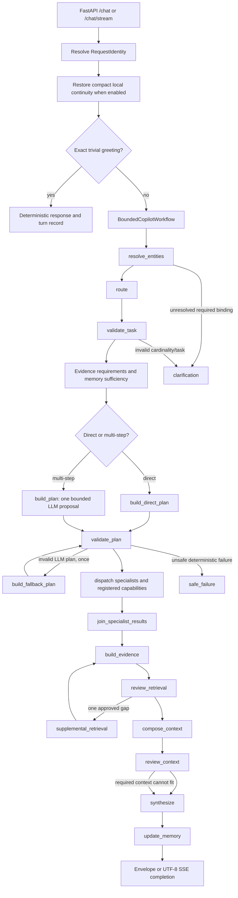
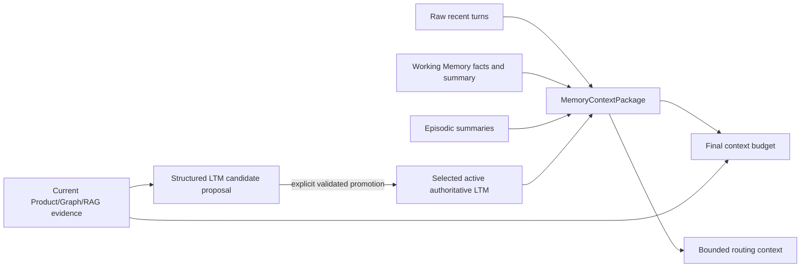
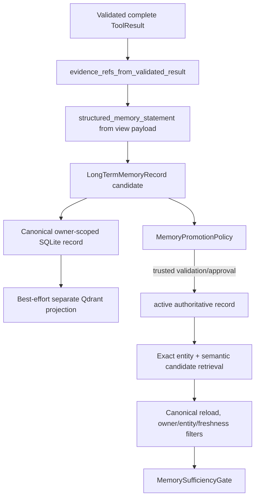
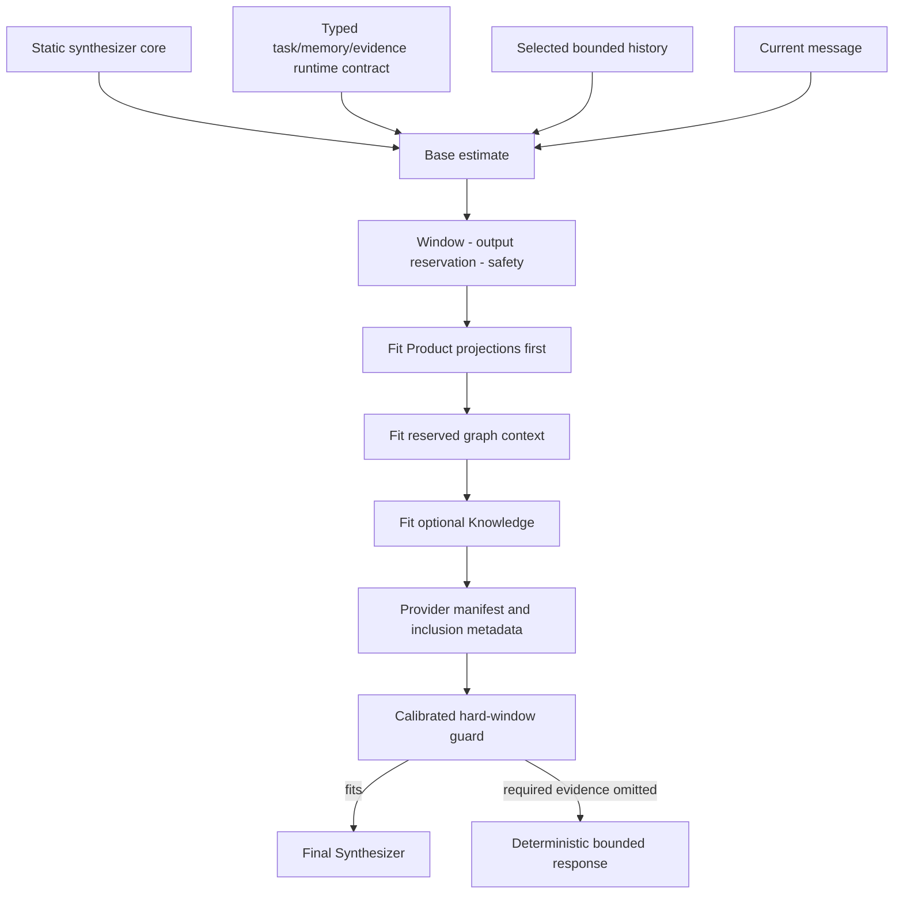
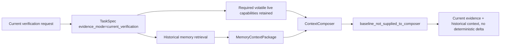

# Soorin Copilot Memory and Workflow Audit: Current `dev`

**Audit date:** 2026-08-15

**Branch:** `dev`

**Audited HEAD:** `a2d3f2502c780fc052e3dd4670d4804a3cd88239` (`fix(memory): harden recall persistence and local auth`)

**Audit mode:** static repository, configuration, tests, and Git-history inspection only

**Runtime evidence:** no services, models, Product endpoints, Qdrant operations, graph refresh, or UI were run

> **2026-08-16 stabilization update:** The implementation findings below describe
> the audited starting commit. The E1-E7 changes completed in the current working
> tree supersede the former delta-path P0 and the related “partially implemented”
> statements. Focused offline tests were run; no external services were used.

## Stabilization result (current working tree)

- Natural historical-summary language is classified explicitly, while “current,”
  “still,” “latest,” “recheck,” and equivalent verification language retains live
  Product requirements unless the user explicitly forbids refresh.
- Focused identity-contradiction requests select profile and detection evidence;
  Graph or Knowledge is added only when topology or explanatory context is asked for.
- The Synthesizer receives execution facts (live request/performance/count/timestamps
  and accepted working-fact writes). Reviewer caveats are separated from material
  limitations, so ordinary provider caveats no longer imply missing evidence.
- Production composition now builds current and historical typed projections and
  emits a deterministic delta only for an accessible, authoritative, complete,
  owner/entity/capability/view/schema-compatible baseline. Every mismatch fails
  closed and current evidence remains authoritative.
- Candidate LTM writes carry a deterministic owner-scoped content fingerprint.
  Exact live replays return the existing record; changed evidence remains distinct.
  SQLite schema v6 adds the nullable fingerprint and a live-record partial unique index.
- A portable storage policy bounds conversations, messages, working facts, active
  LTM, and candidate LTM per owner. Cleanup preserves newest chat data and durable
  thread state, evicts candidate memory only, and rejects active-memory overflow.

The original audit started with a user-modified `.env.example`, untracked
`.claude/`, and this untracked audit document. Those pre-existing changes were
preserved; the stabilization added only the documented safe-default quota keys.

## 1. Purpose and authority

This document is the authoritative current-state audit for the memory, evidence,
context, and bounded investigation workflow on `dev`. Source code at the audited
HEAD is authoritative. Existing documents are treated as claims to verify, not as
the source of truth.

The audit uses these labels:

| Label | Meaning |
| --- | --- |
| `CURRENT_IMPLEMENTED` | Production request code is wired and reachable when its normal preconditions hold. |
| `IMPLEMENTED_BUT_DISABLED_BY_DEFAULT` | Runtime implementation exists, but tracked defaults leave it off. |
| `LOCAL_DEV_ONLY` | Implemented only by the local simulation/SQLite boundary, not as production ownership or persistence. |
| `PARTIALLY_IMPLEMENTED` | Contracts or components exist, but the end-to-end production path is incomplete. |
| `DEFERRED` | Deliberately not implemented in the current runtime. |
| `STALE_DOCUMENTATION` | A checked-in document describes an older or contradictory state. |
| `UNKNOWN` | Repository evidence is insufficient for a safe conclusion. |

## 2. Executive findings

### Top five findings

1. **The bounded LangGraph is the normal request controller.** It has explicit
   deterministic nodes, conditional edges, a recursion limit of 32, at most one
   deterministic plan fallback, and at most one supplemental retrieval. It is
   not an unrestricted agent loop. (`CURRENT_IMPLEMENTED`)
2. **Memory-first evidence selection is active.** Typed requirements,
   authoritative memory checks, Product view selection, and call skipping are
   wired before execution. Volatile/current requirements fail closed to live
   verification. (`CURRENT_IMPLEMENTED`)
3. **Three memory layers have materially different authority.** Raw/working and
   episodic memory provide conversation continuity; only promoted, active,
   authoritative typed LTM may satisfy an EvidenceRequirement. Candidate LTM is
   not authoritative. (`CURRENT_IMPLEMENTED`)
4. **Current-verification delta support is not wired end to end.** A tested
   `build_delta_context()` utility exists, but production composition explicitly
   records `baseline_not_supplied_to_composer`; the synthesizer memory state marks
   a compatible previous baseline unavailable. (`PARTIALLY_IMPLEMENTED`)
5. **Local restart continuity is real but not production durability.** SQLite
   schema v5 persists local users, transcripts, compact thread state, working
   facts, bounded turn references, episodes, and LTM. LangGraph checkpoints,
   trusted Product identity, multi-replica coordination, and production memory
   storage remain deferred. (`LOCAL_DEV_ONLY` / `DEFERRED`)

### P0 correctness issue

**P0: current-verification requests can receive historical memory and current
evidence without a deterministic compatible baseline/delta contract.** The code
correctly retains live calls for volatile evidence, but it does not construct a
validated entity/view/schema-matched baseline for the composer. This weakens the
system's ability to make precise “what changed” claims and leaves the final model
to interpret two evidence blocks rather than consume a deterministic delta.

**Safest first fix:** add a typed baseline projection selected from authoritative
LTM by exact entity, capability/view, schema version, completeness, and freshness;
pass it to `ContextComposer`; call the existing delta builder only after all checks
pass; otherwise preserve the current full-current-evidence path and explicit
limitation.

**First tests:** production-path tests, not only utility tests, proving (a) matched
baseline produces deterministic changed/new/removed fields, (b) entity/view/schema
mismatch produces no delta, (c) inaccessible/stale/candidate memory produces no
delta, and (d) current evidence remains required and authoritative.

## 3. Baseline and history

The relevant recent history is:

| Commit | Current significance |
| --- | --- |
| `a2d3f25` | Hardened recall persistence, typed working facts, and local scrypt authentication. |
| `af619e0` | Enforced no-refresh authority, entity preservation, episode continuity, and contradiction retention. |
| `70b47db` | Added dynamic synthesizer task/memory context and memory-aware evidence mode. |
| `5010235` | Repaired semantic-memory collection initialization before search. |
| `59ebaba` | Added evidence-aware memory reuse and safe tool selection (Gate 8). |
| `e968e12`, `f9d111d`, `28638e0` | Added typed LTM composition, semantic retrieval/reranking, and canonical memory records. |
| `68db382`, `eb085f2`, `016128d`, `9770217` | Added episodes, local simulation, compact thread persistence, SQLite adapters, and ports. |
| `76567e1`, `52b482c`, `c0da727` | Established the bounded LangGraph, specialists, evidence workflow, and streaming integration. |

Pre-existing working-tree items at audit start were `.env.example` (modified) and
`.claude/` (untracked). They were not read as authoritative changes and were not
modified by this audit.

## 4. Canonical request workflow



### Exact LangGraph topology

`app/src/core/agent/workflow.py::BoundedCopilotWorkflow._compile_graph()` defines:

```text
START -> resolve_entities
resolve_entities -> route | clarification_interrupt
clarification_interrupt -> resolve_entities | clarification
route -> validate_task
validate_task -> build_direct_plan | build_plan | clarification | safe_failure
build_direct_plan -> validate_plan
build_plan -> validate_plan
validate_plan -> dispatch_specialists | build_fallback_plan | safe_failure
build_fallback_plan -> validate_plan
dispatch_specialists -> join_specialist_results
join_specialist_results -> build_evidence
build_evidence -> review_retrieval
review_retrieval -> supplemental_retrieval | compose_context
supplemental_retrieval -> build_evidence
compose_context -> review_context
review_context -> synthesize
synthesize -> update_memory | END
update_memory -> END
clarification -> END
safe_failure -> END
```

The graph compiles without a checkpointer. `SOORIN_LANGGRAPH_CHECKPOINT_BACKEND`
is accepted as a reserved setting, but SQLite checkpointing is explicitly deferred
because the rich `InvestigationState` is not checkpoint-safe. The compatibility
runner preserves the same bounded node contract when LangGraph is unavailable.

## 5. Stage-by-stage implementation audit

| Stage | Primary source/function | Reads | Writes/returns | Decision type | External/LLM | Fallback, bounds, and skips | Memory/persistence | Key tests/events |
| --- | --- | --- | --- | --- | --- | --- | --- | --- |
| API identity | `api/routes.py`; `identity.py::RequestIdentity.resolve` | request body, `X-User-ID` metadata | session/conversation/request/thread IDs | deterministic | none | generates missing IDs; metadata is not authorization | begins optional local request | API/streaming and local-persistence tests |
| Service setup | `copilot/service.py::CopilotService._chat` | request identity, UI context | runtime context and workflow result | deterministic | none | exact greeting fast path skips Router, Planner, tools, Synthesizer | restores compact continuity; finalizes request | request lifecycle logs, usage scope |
| Entity resolution | `agent/nodes.py::resolve_entities`; `context/entities.py` | explicit IPs/CIDRs, UI IP, canonical active entities, bounded recent turns | `EntityResolution`, constraints, pending working facts, LTM selection | deterministic | optional LTM exact/semantic retrieval | explicit > UI > session/recent; detached topics suppress stale entities | reads routing, raw recent turns, working/LTM | entity resolution events; context-routing and memory tests |
| Route | `agent/nodes.py::route`; `context/intent.py` | resolution, previous route, constraints, recent context | normalized route | semantic LLM normally; deterministic validation | Router call normally | memory-only/no-refresh fast path skips Router; provider/schema/confidence failure uses deterministic fallback; Router cannot erase valid recall entity | preserves active entity for recall | Router events and routing tests |
| Task validation | `agent/nodes.py::validate_task`; `task_mapping.py` | route, message constraints, LTM selection | `TaskSpec`, requirements, gap plan, clarification | deterministic | none | max two entities; comparison requires exactly two; no-live produces zero capabilities | Gate 8 evaluates authoritative selected LTM | Gate 8/no-refresh tests and gap logs |
| Direct plan | `task_mapping.py::compile_direct_plan` | validated TaskSpec | bounded `ExecutionPlan` | deterministic | none | no Planner; maximum six calls, depth two, one entity per Product step | memory-satisfied steps later removed | direct-plan tests |
| Planner plan | `agent/planner.py::BoundedPlanner.plan` | TaskSpec and registry catalog | proposed `ExecutionPlan` | LLM proposal | Planner call only for multi-step/live tasks | JSON-only; no tool execution; failures fall back | no memory mutation | planner tests/events/usage |
| Plan validation | `agent/nodes.py::validate_plan`; `agent/validation.py` | proposal, authority, capability specs, gap plan | validated plan or fallback/safe state | deterministic | none | registry/read-only/schema/cardinality/DAG/dependency/duplicate/call/depth checks; one fallback cycle | applies memory-skipped capability results | plan-validation tests/events |
| Specialist dispatch | `agent/nodes.py::dispatch_specialists`; `agent/specialists/` | validated parent steps | specialist results and records | deterministic | capability calls only | Asset and Graph specialist subgraphs add no LLM calls; parent loop dispatches specialist groups deterministically | none | specialist/node events and workflow tests |
| Capability execution | `agent/executor.py`; `agent/registry.py` | validated steps | canonical `ToolResult` values | deterministic orchestration | Product, local graph, Qdrant RAG | max concurrency four; max calls six; Product group serialized; transport/request timeouts; dependency failures skip downstream | request-scoped Product result cache only | executor/capability metrics and tests |
| Evidence pack | `agent/reviewer.py::build_pack` | ordered ToolResults | `EvidencePack` with coverage/status/limitations | deterministic | none | unknown status fails closed; preserves partial success | LTM-backed ToolResults remain identified as memory | evidence tests |
| Retrieval review | `agent/reviewer.py::review`; `nodes.py::review_retrieval` | task, pack, capabilities | sufficient/limited/missing/safe decision | deterministic | none | required capability, binding, status, freshness, completeness, truncation, contradictions | respects memory result limitations | reviewer tests/events |
| Supplemental | `nodes.py::supplemental_retrieval` | reviewer-approved missing capability | one additional ToolResult | deterministic | at most one capability call | validates arguments; duplicate call suppressed; no recursion | none | reviewer supplemental tests/events |
| Context composition | `context/composer.py::compose` | task, pack, Product views, graph, Knowledge, memory package, history | bounded provider context and manifest | deterministic | none | Product-first; Knowledge then Graph may be omitted on pressure; required missing context blocks unsafe synthesis | inserts working facts, episodes, authoritative LTM, bounded turns | budget tests, context metrics/events |
| Context review | `nodes.py::review_context` | composed prompt estimate and required-context flags | synthesize/limited/block decision | deterministic | none | hard window invariant | no writes | budget tests/trace |
| Synthesis | `nodes.py::synthesize`; `context/synthesizer_prompt.py` | static prompt, runtime task/evidence/memory contract, history, current user | final provider result or deterministic safe answer | final LLM normally | Synthesizer call/stream | no call when required context cannot fit; deterministic clarification/safe fallback | no authority mutation | synthesis prompt and streaming tests/events/usage |
| Memory update | `nodes.py::update_memory` | successful final response, task, entities, ToolResults | raw turn, active route/entity state, working/episode state, candidate LTM | deterministic | optional semantic index write for candidate | idempotent request update; candidate only, never auto-promoted | local transcript/thread state and LTM when configured | memory tests and transition logs |
| Response | API/service streaming adapter | final text/typed stream events | existing envelope or SSE schema | deterministic transport | none | UTF-8 SSE; errors remain bounded | request commit finalization | streaming/API tests |

## 6. Router, Planner, and Synthesizer roles

### Semantic Router

- **Purpose:** classify intent/scope/direction/depth and requested evidence from
  already resolved entities.
- **Authority:** semantic classification only; deterministic code owns entity
  extraction, binding authority, schema validation, normalization, and fallback.
- **Normal calls:** one; a configured JSON repair attempt can add one Router
  repair call.
- **No-call paths:** exact trivial greeting and deterministic memory-only/no-live
  recall.
- **Current effective local deployment:** `DeepSeek-V4-Flash` through the
  configured OpenAI-compatible Arvan transport. This is local private
  configuration, not a tracked universal default.

### Bounded Planner

- **Purpose:** propose a structured multi-step read-only plan from `TaskSpec` and
  the capability catalog.
- **Authority:** proposal only. It cannot add URLs, invent entities, execute tools,
  mutate memory, or bypass `PlanValidator`.
- **Normal calls:** zero for direct tasks; one for eligible multi-step tasks. A
  deterministic mechanical repair/fallback does not add an LLM call.
- **Current effective local deployment:** `DeepSeek-V4-Flash`; Planner enabled.

### Final Synthesizer

- **Purpose:** turn the reviewed, budgeted context into the requested answer.
- **Prompt:** `app/prompts/synthesizer_static_prompt.md` plus the deterministic
  runtime contract built by `context/synthesizer_prompt.py`; current prompt
  builder version is `synth-context-v1`.
- **Authority:** wording and bounded analysis only. It cannot create evidence or
  mutate routing/memory authority.
- **Current effective local deployment:** `DeepSeek-V4-Flash`, 32,768-token
  context window, 12,288 configured max output, 2,048 safety margin, and 1.35
  conservative estimate multiplier.

Typical substantive calls are Router + Synthesizer for direct work and Router +
Planner + Synthesizer for multi-step work. Repair attempts can increase Router or
Planner transport calls. Specialists, reviewer, evidence gap, compaction, and
memory updates add no LLM calls.

## 7. Capability and evidence architecture

### Capability registry

| Capability | Cardinality | Source | Evidence role | Planner visible | Important bounds |
| --- | ---: | --- | --- | --- | --- |
| `asset.get_profile` | 1 | Product API | current asset identity/security/network/activity | yes | one entity per step; Product serialization lock |
| `asset.get_detection` | 1 | Product API | current classifier/rule/similarity/cluster evidence | yes | one entity per step; Product serialization lock |
| `graph.get_summary` | 1 | NetworkX snapshot | node topology summary | yes | depth 0 |
| `graph.get_neighbors` | 1 | NetworkX snapshot | one/two-hop or exhaustive direct peers | yes | depth <= 2 and configured node/edge limits |
| `graph.get_relationship` | 2 | NetworkX snapshot | direct relation | yes | exactly two entities |
| `graph.compare_assets` | 2 | NetworkX snapshot | bounded topology comparison | yes | exactly two entities; per-entity/shared-peer limits |
| `graph.find_path` | 2 | NetworkX snapshot | observed graph shortest path | yes | exactly two entities; bounded path length |
| `knowledge.search` | 0 | Qdrant SOC corpus | documentation/runbook knowledge | yes | Top-K, score, token, and citation limits |

All registered capabilities are read-only. The executor runs dependency-ready
steps concurrently up to four workers, but serializes Profile and Detection
through the shared Product concurrency group. Graph is local. Knowledge is
Qdrant-backed. Synchronous calls that outlive a future timeout cannot be forcibly
killed; transport-native timeouts remain the hard operational boundary.

### Product evidence projections

The model does not receive raw Product objects by default. Raw payloads remain
internal on `ToolResult`; deterministic projections expose only validated views:

- Profile: `overview`, `identity`, `security`, `network`, `activity`, `full`.
- Detection: `overview`, `evidence`, `similarity`, `cluster`, `full`.

Gate 8 derives evidence classes, selects the minimum unresolved views, and keeps
projection omissions/counts explicit. Explicit deep/full requests may still be
large. A request-scoped fetch cache avoids duplicate Product retrieval inside one
request, but there is no durable operational-evidence cache across requests.

### NetworkX graph evidence

- Startup loads the last-known-good pickle into an active in-memory graph.
- The current local configuration enables background refresh, startup refresh,
  and a 900-second interval. Refresh calls Product, validates node/edge/drop
  thresholds, writes required artifacts and bounded snapshots atomically, then
  replaces the active graph only after validation.
- Retrieval and serialization have separate completeness contracts. Returned
  totals are not silently rewritten when context serialization omits nodes/edges.
- Current effective limits include one-hop 350 nodes, two-hop 800 nodes, 4,000
  graph edges, 7,000 graph-context tokens, path length 24, and bounded comparison
  peers. These are environment-resolved values, not universal constants.
- Graph evidence proves observed relationships in the snapshot, not physical
  route, trust, reachability, dependency, or compromise.

### Knowledge RAG

- `knowledge.search` is a typed capability; it returns status, backend, freshness,
  chunks, scores, citations, limitations, candidate/included counts, and
  truncation without exposing Qdrant objects.
- The current local configuration uses embedded Qdrant local mode, collection
  `soorin_soc_knowledge_bge_base_v1`, and BGE
  `BAAI/bge-base-en-v1.5` (768 dimensions).
- The Hugging Face embedder is lazy, uses attention-mask-aware mean pooling and
  L2 normalization, and currently requires local cached files by configuration.
- Corpus scanning, embedding, and indexing do not occur at import or application
  startup. Indexing remains a separate maintenance operation.
- Knowledge is documentation evidence and cannot establish live identity,
  detections, graph peers, alerts, or risk.

## 8. Memory architecture

### 8.1 Memory layers and authority



| Layer | Content | Scope/lifetime | Authority | Persistence |
| --- | --- | --- | --- | --- |
| Raw history | bounded user/assistant messages and latest completed turn | session/thread | conversation continuity only | in process; local transcript SQLite when enabled |
| Working Memory | active context key, compact summary, recent previews, providers, limitations, typed user-provided facts | one conversation, active episode | user-provided facts retain user provenance; not operational truth | in process; compact form in local SQLite |
| Episodic memory | archived bounded investigation summary, entities, role, findings, contradictions, unresolved questions, next checks, evidence scope, limitations | same conversation, matching context | historical conversation context | in process; bounded local SQLite when enabled |
| Candidate LTM | atomic statement derived from validated structured ToolResult | owner/entity scoped | non-authoritative | canonical local SQLite; best-effort semantic index |
| Active LTM | promoted atomic record with analyst/source/historical authority | owner/entity scoped and cross-conversation | may satisfy compatible historical/revision requirements | canonical local SQLite; separate Qdrant projection |
| Routing state | active entities and previous route/provider continuity | session/thread | deterministic authority continuity | in process; compact local SQLite when enabled |
| LangGraph state | rich request execution state | one request | workflow authority | not durable; no checkpointer |

### 8.2 Raw history and compaction

`MemoryStore.record_turn()` records the completed user/assistant pair
idempotently and protects the latest completed turn from compaction.
`prepare_for_model()` activates the matching `MemoryContextKey`, performs
deterministic compaction if required, and creates a `MemoryContextPackage`.

Selection is bounded by the current effective local values:

- maximum four relevant turns;
- 900 tokens for relevant turns;
- maximum two episode summaries;
- 300 episode tokens;
- 1,400 tokens for the short-term memory package;
- a separate 500-token LTM budget.

Detached general questions select general turns and do not receive asset-only raw
history. Changing entity/topic archives the old episode and clears active raw
history/summary for the new key. Matching historical episodes can re-enter later.

The implementation has one subtle budget distinction: the 1,400 short-term
budget governs summary/turns/episodes, while LTM and working facts are added under
their own controls. It should not be described as a single hard cap over every
memory section.

### 8.3 Working facts

Working facts are deterministic, conversation-scoped, and currently support a
bounded set of recognized fact types, including analyst name, investigation tag,
owner validation, identity contradiction, and analyst note. Unsupported natural
language is not guaranteed to become a typed fact. Facts remain working/session
memory and are not automatically promoted to validated LTM.

Example implemented path:

```text
"For this investigation only, remember: tag is ORION-115,
 owner validation is pending, identity contradiction is ..."
-> derive_request_constraints(memory_write=true, allow_live=false for pure write)
-> extract_working_facts()
-> WorkingFact(fact_type=user_provided)
-> MemoryStore.upsert_working_facts()
-> durable ThreadMemoryState when local SQLite is enabled
-> later deterministic memory recall selects the facts
-> zero Product/Detection/Graph/Knowledge calls
```

This path is covered in `test_memory_no_refresh_regressions.py`. It does not make
ORION-115 an authoritative organizational fact or LTM.

### 8.4 Episodic memory

An active `WorkingMemory` has one `episode_id`. Same-asset memory recall and
no-refresh reassessment preserve that episode. On context transition,
`_archive_current_episode()` stores a bounded `EpisodeRecord` with structured
fields. Compaction extracts bounded role/findings/contradictions/unresolved/next
checks/evidence scope/limitations; no LLM is used.

The current `episode_updated` lifecycle describes working-state updates. A durable
archived `EpisodeRecord` is created on transition/archive, not for every turn.
Selection requires a non-empty compact summary and a compatible context key.

### 8.5 Typed LTM lifecycle



Production candidate creation is
`nodes.py::_propose_long_term_candidates()` ->
`evidence_policy.py::evidence_refs_from_validated_result()` ->
`structured_memory_statement()` ->
`LongTermMemoryCoordinator.create_candidate()`.

Candidate creation requires structured evidence that is `ok`, complete,
untruncated, context-included, free of active contradiction, and based on a usable
projection. The statement is serialized from the validated view payload, never
from assistant prose. Evidence-class references such as
`evidence_class_asset_role` are derived only for classes actually supported by
the capability/view. Existing references are preserved and deduplicated through
promotion.

Candidates remain non-authoritative. Promotion is an explicit coordinator/policy
operation; this audit found no normal public analyst approval endpoint or UI flow.
That makes promotion operationally incomplete even though the canonical lifecycle
is implemented and tested.

The canonical local store supports create/get/list, optimistic revision update,
promote, invalidate, supersede, delete, index status, and reconciliation. Semantic
index failure never deletes canonical memory. Reconciliation is explicit, not a
startup action. Candidate creation currently uses new UUIDs and has no observed
content/evidence deduplication key, so repeated equivalent investigations can
create duplicate candidates.

### 8.6 LTM retrieval and Gate 8

Retrieval occurs after deterministic entity resolution and before semantic
routing:

1. owner-scoped exact active-entity lookup;
2. optional BGE/Qdrant candidate search with owner/status filters;
3. canonical SQLite reload;
4. entity, lifecycle, authority, validity, and freshness filtering;
5. exact-over-semantic deduplication and bounded Top-K;
6. optional CrossEncoder reranking (currently disabled);
7. token-bounded insertion into `MemoryContextPackage`.

The semantic index is a retrieval accelerator, not the source of truth. Exact
canonical retrieval remains usable when semantic retrieval is unavailable.

`MemorySufficiencyGate._covers()` requires an explicit
`evidence_class_<class>` reference. It also checks exact entities, active and
authoritative state, contradictions, completeness/exhaustiveness, and freshness.

Concrete outcomes:

```text
validated active memory
+ exact entity
+ evidence_class_asset_role
+ complete/revision-compatible requirement
-> memory_sufficient
-> matching Profile step removed
-> synthetic ToolResult(provider=long_term_memory)
-> live tool skipped explicitly
```

```text
missing tag, wrong entity, candidate/unconfirmed record,
stale volatile evidence, contradiction, partial/truncated record,
or current_verification requirement
-> live_evidence_required / verification_required / contradictory_memory
-> live capability remains in the validated plan
```

This is fail-closed behavior. Semantic similarity alone cannot establish entity
or evidence-class authority.

## 9. Request controls and evidence modes

`task_mapping.py::derive_request_constraints()` deterministically recognizes:

- memory recall;
- explicit no-live/no-refresh constraints;
- working-memory writes;
- explicit current-evidence/refresh requests.

| Request condition | Evidence mode | Router | Planner | Live capabilities | Entity/episode behavior |
| --- | --- | --- | --- | --- | --- |
| Normal operational request | `normal` | semantic | only if multi-step | as TaskSpec requires | normal authority and updates |
| “current/latest/refresh/recheck” | `current_verification` | semantic | if multi-step | volatile required evidence retained | historical memory may be context, never replacement |
| “without refreshing/do not call live” | `no_live_refresh` | deterministic control is authoritative | skipped | zero | preserve same-asset entity and episode |
| “what did I tell you/from stored context” | `memory_only` | deterministic recall path | skipped | zero | preserve compatible active entity/episode |
| Pure “remember …” write | memory-only write | skipped | skipped | zero | upsert bounded working facts |
| General detached question | normal/general | semantic | normally skipped | Knowledge only if selected; no stale asset context | active routing entity preserved but not supplied as current binding |

The phrase matching is deterministic and bounded rather than a general semantic
memory-intent model. Supported variants are well tested, but novel paraphrases can
still route normally and should be treated as a known coverage limitation.

## 10. Context construction and token authority



### Authority order in final context

| Rank | Source | Rule |
| ---: | --- | --- |
| 1 | Current validated Product/Graph evidence | Operational source of truth for this request, subject to freshness/completeness metadata. |
| 2 | Current Knowledge RAG | Documentation only; cannot override operational evidence. |
| 3 | Active authoritative typed LTM | Historical/revision evidence only within exact entity/class/freshness scope. |
| 4 | Working/episodic memory and selected raw turns | Conversation continuity; not verified operational evidence. |
| 5 | Prior assistant prose | Never evidence authority; excluded when detached and compacted before current evidence. |

### Budget behavior

The composer computes the base prompt, reserves output and safety tokens, applies
the conservative estimate multiplier, and allocates dynamic context. Product
projections are protected first; Graph receives a reserve; Knowledge is optional
unless specifically required. On pressure, Knowledge is removed before Graph,
then Graph can be omitted with explicit metadata. Product section fitting can
omit unresolved evidence classes only with an explicit required-context failure.

The source contains `MemoryStore.fit_messages_to_budget()`, and focused tests
exercise it, but the audited production compose path does not call it as the
final hard-window correction described in older documentation. Production
recomposition is currently the bounded dynamic-section omission path. Therefore
claims that production always trims history and then reduces output to a detail
floor are not established by the current source.

Exact Product field deduplication preserves support/conflict/timestamp
distinctions. Graph retrieval completeness and model serialization completeness
are separate. Context inclusion metadata is written back into ToolResults and the
EvidencePack before synthesis and memory candidate evaluation.

## 11. Current-verification and delta audit



The following are implemented:

- current-verification recognition;
- volatile EvidenceRequirements that cannot be skipped by old memory;
- historical LTM selection and inclusion metadata;
- a standalone `build_delta_context()` utility with identity/schema/accessibility
  checks and changed/new/removed output;
- prompt rules forbidding delta language without deterministic delta metadata.

The following production link is missing:

- no compatible baseline object is selected and supplied to `ContextComposer`;
- `SynthesizerMemoryState.compatible_previous_baseline_available` is false;
- `delta_context_skipped reason=baseline_not_supplied_to_composer` is logged.

Result: the system safely refreshes, but deterministic change analysis is
`PARTIALLY_IMPLEMENTED`, not current production behavior.

## 12. Persistence and ownership matrix

| Data | Canonical owner in current code | Backend | Restart survival | Production-ready? |
| --- | --- | --- | --- | --- |
| API session/routing state | Copilot process | dictionaries; optional compact thread adapter | process only or local SQLite | no trusted tenant adapter |
| Raw transcript | local simulation ChatRepository | SQLite schema v5 | yes in local mode | no; Product should own production transcript |
| Working facts/summary | Copilot ThreadMemoryState | memory + optional SQLite | yes in local mode | no multi-replica/tenant authority |
| Episodes | Copilot MemoryStore/ThreadMemoryState | memory + bounded optional SQLite | yes in local mode | no production durable store |
| LTM canonical records | LongTermMemoryStore | local SQLite | yes | local-development implementation only |
| LTM semantic projection | SemanticMemoryIndex | separate Qdrant collection | yes if storage available | accelerator only, never canonical |
| SOC Knowledge | KnowledgeSearchService | separate Qdrant collection | yes | externally maintained index |
| Graph | GraphRefreshService/loader | files + in-memory NetworkX | last-known-good file survives | operational artifact, not conversation memory |
| LangGraph execution | InvestigationState | memory only | no | checkpointing deferred |
| LLM usage report | request-local collector | outbound Product POST when enabled | Product-owned after delivery | non-fatal and idempotent per request |
| Metrics/logs | observability subsystem | Prometheus/log files/stdout | deployment dependent | operational telemetry, not evidence |

### Local authentication

Local simulation now uses normalized username/password login with
`hashlib.scrypt`, a cryptographically random per-user salt, encoded algorithm/
version/N/r/p parameters, and constant-time comparison. Internal
`local-user-<uuid>` identifiers remain stable. This affects local simulation only;
it does not replace Product authentication or the Copilot API-key boundary.

The local schema version is **5**, not 4. The local database contains users,
conversations, messages, request commits, thread states, LTM records, and LTM
entity links. This is additive development infrastructure, not a parallel
production identity system.

## 13. Observability audit

### Wired production observability

- Compact allowlisted workflow events include request/trace/session IDs and
  bounded stage/capability/status/count/latency metadata.
- Node wrappers emit start/completion/failure/retry/skip lifecycle records.
- Router, Planner, provider, capability, memory gap, context, workflow, and
  synthesis paths expose compact logs without credentials, prompts, raw payloads,
  full responses, or hidden reasoning.
- Human traces have summary/detailed modes and are built from final
  `InvestigationState`. Sensitive fields are omitted.
- Prometheus metrics cover HTTP, workflow, LLM calls/tokens, tools, memory
  retrieval/decisions, context estimates/savings, Product views, and coarse
  errors. High-cardinality/sensitive labels are explicitly forbidden.
- `/metrics` is authenticated. The optional Compose observability profile includes
  Prometheus, Loki, Alloy, Grafana, persistent volumes, and a provisioned dashboard.
- LLM usage is collected per request with duplicate `call_id` suppression and can
  be reported once through the shared authenticated Product client. Only Router,
  Planner, and Chat purposes actually run are aggregated into the outbound body.

### Partially wired observability

`EvidenceSnapshotWriter` is implemented, tested, configured, and instantiated by
`CopilotService`, including redaction, atomic private writes, and retention.
However, the audit found no production call to `snapshot_writer.write()`.
Therefore evidence snapshots are `PARTIALLY_IMPLEMENTED` even when the current
local setting enables summary mode. Tests call the writer directly; normal
requests do not currently produce a snapshot through this object.

### Performance risks visible from source

1. Product transport timeout and a timed-out executor future cannot cancel an
   already-running synchronous request.
2. Graph startup refresh is enabled in the current local configuration and may
   delay or add Product load; last-known-good loading remains separate and safe.
3. Deep/full Product views can dominate context despite view compaction.
4. BGE and CrossEncoder are lazy, but a cold semantic query can load local model
   files; reranking is disabled, reducing this risk.
5. Embedded local Qdrant must be single-process coordinated; the current runtime
   is not a multi-replica design.
6. Repeated equivalent structured evidence can create duplicate LTM candidates.
7. Normal reviewer limitations can produce `completed_with_limitations`; operators
   should distinguish expected bounded caveats from provider failure.

## 14. T2-T7 evidence and failure-class audit

**T2–T7 runtime evidence was not available in the repository during this audit.
No runtime conclusion is made from those tests.** The repository does contain
focused offline regression tests labelled T3/T4/T4B/T4C and M1-M6. The table below
classifies failure classes from source and tests, not from live execution.

| Failure class | Source-level assessment | Evidence |
| --- | --- | --- |
| Typed Working Memory write does not occur | `POSSIBLE` for unsupported paraphrases; `NOT_SUPPORTED` for recognized forms | `extract_working_facts()` recognizes a bounded pattern set; M1/M3 cover ORION/name/owner/contradiction forms. |
| Recent-turn recall unavailable while typed facts are empty | `NOT_SUPPORTED` for compatible selected turns | `MemoryContextPackage` can include recent raw turns independently of typed facts; Gate 5 tests cover selection. |
| Episode updated but not selected | `CONFIRMED_BY_CODE` as a possible lifecycle distinction | Working episode updates occur per turn; archived selection needs a compact summary and matching key. |
| Natural historical recall misses fast path | `POSSIBLE` | Deterministic recall is regex/phrase bounded; novel semantic paraphrases can reach Router. |
| Current verification lacks compatible baseline | `CONFIRMED_BY_CODE` | Composer logs `baseline_not_supplied_to_composer`; delta utility is not wired to production. |
| Analyst-note provenance is lost | `PARTIALLY_CONFIRMED` | Typed `WorkingFact` retains `user_provided`, but rendered working-fact context does not expose a rich provenance object. LTM candidates do not use assistant/user prose, preventing Product misattribution there. |
| Mixed operational + personal-memory request becomes memory-only | `NOT_SUPPORTED` for tested forms, `POSSIBLE` for novel phrasing | M5 proves a current check plus name write retains live capabilities; matching remains deterministic. |
| Restart restores only transcript, not typed facts | `NOT_SUPPORTED` in local SQLite mode for recognized facts | M3 and ThreadMemoryState persist/restore typed working facts and bounded episodes. |
| Duplicate LTM candidates | `CONFIRMED_BY_CODE` | Candidate IDs are new UUIDs and no evidence/content idempotency key was found. |
| Normal caveats overproduce limited status | `CONFIRMED_BY_CODE` as policy behavior | Reviewer limitations feed `answer_with_limitations`; whether this is undesirable requires runtime/product policy evidence. |

### Focused memory scenarios currently covered

| Scenario | Expected invariant | Repository test evidence |
| --- | --- | --- |
| T3 memory-only summary | active entity preserved; zero live steps | `test_t3_memory_only_preserves_active_entity_and_has_zero_live_steps` |
| T4 no-live reassessment | same asset investigation; zero live steps | `test_t4_no_live_reassessment_preserves_asset_investigation_and_has_zero_live_steps` |
| T4B contradiction recall | exact XP vs Chrome/Windows contradiction survives compaction/archive | `test_t4b_compaction_and_episode_archive_keep_exact_contradiction` |
| T4C personal name recall | sticky working fact survives compaction; no LTM | `test_t4c_sticky_user_fact_survives_compaction_without_long_term_memory` |
| M1/M2 | typed investigation facts and deterministic recall | `test_m1_*`, `test_m2_*` |
| M3 | typed facts survive durable local restore | `test_m3_typed_working_facts_survive_durable_state_restore` |
| M4 | current reassessment retains live calls and historical memory | `test_m4_current_reassessment_keeps_live_capabilities_and_historical_baseline` |
| M5/M6 | mixed current + name write; conversation isolation | `test_m5_*`, `test_m6_*` |

## 15. Documentation comparison

### `docs/CURRENT_ARCHITECTURE.md`

| Claim | Classification | Current source truth |
| --- | --- | --- |
| Bounded LangGraph is normal request path | `CURRENT_IMPLEMENTED` | Confirmed in service/workflow. |
| Gate 8 evidence gap and safe tool selection | `CURRENT_IMPLEMENTED` | Confirmed in evidence policy and nodes. |
| Local thread adapters are disabled by default | `STALE_DOCUMENTATION` for current effective environment; tracked defaults may differ | Current private configuration enables local simulation, SQLite thread state, LTM, and vector index. |
| Local SQLite LTM schema is v4 | `STALE_DOCUMENTATION` | `LOCAL_SCHEMA_VERSION = 5`; v5 adds username/password credentials and thread migration updates. |
| Streamlit local mode uses a password-free user selector | `STALE_DOCUMENTATION` | Current local UI/API use scrypt-backed signup/login. |
| Raw conversation/episodes remain process-local | `PARTIALLY_IMPLEMENTED` / stale wording | Default in-memory remains, but optional local SQLite persists transcript, working facts, turn refs, and episodes. Production durability remains absent. |
| Production hard guard trims history, recomposes, and may reduce output | `STALE_DOCUMENTATION` / not established | `fit_messages_to_budget()` exists and is tested, but production composer does not invoke the described full correction sequence. |
| Evidence snapshots are request-scoped runtime output | `PARTIALLY_IMPLEMENTED` | Writer exists and is instantiated, but no production write call was found. |
| Current/historical compatible delta context exists | `PARTIALLY_IMPLEMENTED` | Delta utility exists; compatible baseline is not supplied in production. |
| Roadmap says add Gate 8 next | `STALE_DOCUMENTATION` | Gate 8 is already wired and tested. |
| Typed LTM is disabled by default | `IMPLEMENTED_BUT_DISABLED_BY_DEFAULT` as tracked design; current local env enables it | Runtime behavior is environment-dependent. |

### `docs/MEMORY_CONTEXT_UPGRADE_DESIGN.md`

| Claim | Classification | Current source truth |
| --- | --- | --- |
| Audit baseline is HEAD `f9a62c6` plus Gate 3 tree | `STALE_DOCUMENTATION` | Current audited HEAD is `a2d3f25`, after Gates 4-8 and memory hardening. |
| Raw/working/episodic memory is process-local | `PARTIALLY_IMPLEMENTED` | Local SQLite persistence now restores bounded typed state; production remains deferred. |
| No typed durable memory store exists | `STALE_DOCUMENTATION` | Typed LTM canonical SQLite store, lifecycle, retrieval, and separate semantic index exist. |
| Local simulation is future and password-free | `STALE_DOCUMENTATION` | Local simulation and scrypt authentication are implemented. |
| Gate 8 added evidence requirements/tool skipping | `CURRENT_IMPLEMENTED` in document header | Confirmed. |
| Gate 8 remains deferred | `STALE_DOCUMENTATION` and internally contradictory | The ending section contradicts the header and current code. |
| Local schema v4 | `STALE_DOCUMENTATION` | Current schema is v5. |
| Delta context is a future improvement | `PARTIALLY_IMPLEMENTED` | Utility/test exist; production baseline integration remains future work. |
| LangGraph checkpointing and Product persistence are deferred | `CURRENT_IMPLEMENTED` as a statement of absence | Confirmed. |

## 16. What is working now

| Area | Current status | Confidence |
| --- | --- | --- |
| Explicit/UI/session entity precedence and topic detachment | working, deterministic | high: source + focused tests |
| Semantic Router primary path with strict normalization/fallback | working | high |
| Direct vs bounded Planner workflow | working | high |
| Capability allowlist, validation, cardinality, DAG, and budgets | working | high |
| Product projection and request-scoped reuse | working | high |
| NetworkX scoped retrieval and separate serialization completeness | working | high |
| Knowledge RAG as optional documentation evidence | working when configured/index available | medium: offline tests, no live audit |
| No-refresh/memory-only hard authority | working for covered deterministic forms | high |
| Latest completed raw turn retention and topic detachment | working | high |
| Working fact and episode local restart continuity | working in local SQLite mode | high: source + offline tests |
| LTM candidate authority separation and promotion policy | working | high |
| Gate 8 memory coverage and fail-closed live verification | working | high |
| UTF-8 streaming contracts | working by source/tests | high; not live-tested here |
| Metrics/events/human trace/usage collection | wired | high |

## 17. Known problems and gaps

| Priority | Gap | Impact | Safe direction |
| --- | --- | --- | --- |
| P0 | No production-wired compatible baseline/delta for current verification | Change claims can be less precise or model-inferred | Add typed exact baseline adapter and production-path tests. |
| P1 | No public/approved analyst promotion workflow for LTM | Candidate memory accumulates but cannot complete an operational governance loop | Add authenticated Product-owned approval contract later; do not auto-promote. |
| P1 | Equivalent candidate LTM can duplicate | Storage/index noise and reviewer burden | Add deterministic candidate idempotency fingerprint over owner/entity/capability/view/evidence refs/content hash. |
| P1 | No production tenant/user persistence adapter | Local SQLite cannot support real multi-user/multi-replica production | Implement Product API/PostgreSQL ports with trusted identity and ownership. |
| P1 | Evidence snapshot writer is not called | Config suggests artifacts exist when none are emitted | Wire one bounded post-review/post-compose call or remove runtime-enable claim. |
| P2 | Memory-write/recall intent extraction is phrase-bounded | Novel paraphrases can miss no-call path | Expand deterministic grammar carefully; preserve hard no-live phrases and semantic Router fallback. |
| P2 | Working-fact provenance is flattened in model text | User fact/source distinction is less explicit to Synthesizer | Render bounded fact type/provenance in runtime contract without promoting authority. |
| P2 | Production hard-window correction differs from docs | Operators may expect history trimming/output reduction not actually wired | Either wire tested correction through composer or update canonical docs after tests. |
| P2 | Synchronous timed-out providers cannot be cancelled | Resource use may continue after request deadline | Prefer native async/cancellable transports or strict native timeouts. |
| P2 | Expected limitations can mark requests limited | Operational status may be noisy | Define materiality policy and test expected caveats separately from evidence failure. |
| P3 | No durable LangGraph checkpoint | In-flight request cannot resume after restart | Keep deferred until a safe serializable state projection exists. |
| P3 | CrossEncoder reranker disabled | Semantic ordering relies on BGE only | Keep disabled until offline quality/latency evidence justifies it. |

## 18. Safe implementation order

1. **Fix current-verification baseline/delta integration** with exact typed
   matching and fail-closed tests. Do not change memory authority.
2. **Add candidate idempotency** before exposing any approval workflow.
3. **Wire or explicitly disable evidence snapshots** so configuration matches
   runtime behavior.
4. **Define Product-owned approval and tenant persistence contracts** before
   production LTM rollout.
5. **Align existing architecture documents** to this audit after behavior is
   accepted; remove contradictory Gate and schema claims.
6. **Only then consider checkpoint-safe workflow persistence**, with a compact
   serializable projection rather than rich provider/model objects.

## 19. Test inventory and confidence boundary

Relevant focused suites include:

- `test_memory_no_refresh_regressions.py`: T3/T4/T4B/T4C and M1-M6.
- `test_memory_gate5.py`: relevant-turn selection, detachment, restart restore,
  isolation, and shared UI backend behavior.
- `test_long_term_memory_gate67.py`: canonical lifecycle, migration, exact/
  semantic retrieval, dedup, reranker fallback, context budget, and workflow
  retrieval.
- `test_gate8_memory_context.py`: requirements, evidence-class references,
  promotion preservation, candidate creation, memory sufficiency, Product views,
  dedup, delta utility, and efficiency fixtures.
- `test_phase2_agent_workflow.py`: PlanValidator, Planner bounds, executor
  concurrency, EvidencePack/reviewer, specialists, events, and snapshot writer.
- `test_context_budget_allocation.py`: Product/Graph/Knowledge allocation,
  graph completeness, stale-history fitter behavior, and hard estimates.
- `test_synthesizer_prompt_context.py`: dynamic runtime prompt contracts.
- local SQLite/local simulation tests: schema/auth/ownership/restart behavior.

This audit did not execute those suites. Test names and assertions establish
offline coverage, not live Product/model/Qdrant correctness. The following remain
unverified here:

- Product endpoint payload parity and latency;
- actual graph refresh and last-known-good replacement;
- Arvan/DeepSeek Router, Planner, and streaming Synthesizer behavior;
- BGE cache/model load and Qdrant collection health;
- local SQLite/Qdrant behavior under multiple processes;
- browser/UI memory and stream behavior;
- production authentication/tenant ownership integration.

## 20. Final current-state classification

| Subsystem | Classification |
| --- | --- |
| Bounded LangGraph direct/multi-step workflow | `CURRENT_IMPLEMENTED` |
| Semantic Router with deterministic validation | `CURRENT_IMPLEMENTED` |
| Deterministic Planner validation/fallback | `CURRENT_IMPLEMENTED` |
| Product/Graph/Knowledge capability wrappers | `CURRENT_IMPLEMENTED` (availability is configuration/runtime dependent) |
| Raw/Working/Episodic memory | `CURRENT_IMPLEMENTED` in process; `LOCAL_DEV_ONLY` durable mode |
| Typed LTM canonical lifecycle | `CURRENT_IMPLEMENTED` locally; production governance/persistence deferred |
| Semantic LTM index/reranker | index `CURRENT_IMPLEMENTED` when enabled; reranker `IMPLEMENTED_BUT_DISABLED_BY_DEFAULT` |
| Gate 8 memory sufficiency/tool skipping | `CURRENT_IMPLEMENTED` |
| Current-verification deterministic delta | `PARTIALLY_IMPLEMENTED` |
| Local username/password authentication | `LOCAL_DEV_ONLY` |
| LangGraph checkpoint resume | `DEFERRED` |
| Product-owned users/transcripts/memory | `DEFERRED` |
| Evidence snapshots in normal request path | `PARTIALLY_IMPLEMENTED` |
| Prometheus/Loki/Grafana observability | `CURRENT_IMPLEMENTED` as optional deployment profile |
| Existing memory/architecture documents | contain `STALE_DOCUMENTATION`; use this audit for current `dev` state |

The current system is a bounded evidence workflow with meaningful memory-first
controls, not an autonomous agent and not yet a production multi-tenant memory
platform. Its strongest properties are deterministic authority, fail-closed
evidence selection, bounded execution, and separation of conversation context
from authoritative LTM. The safest next change is the narrow typed baseline/delta
integration described above.

## 21. 2026-08-16 lifecycle completion addendum

This addendum supersedes the earlier Gate 6/7 and delta classifications in this
audit. In the current working tree, typed LTM has a complete local candidate-to-
active lifecycle and current-verification delta composition is implemented.

The memory hierarchy is explicit: bounded raw turns support immediate continuity;
typed working facts are conversation- or entity-scoped analyst/user assertions;
bounded episodes are historical investigation summaries; candidate LTM is durable
but non-authoritative; and active LTM is the only durable layer that can satisfy
Gate 8. None of the first four layers establishes current operational truth.

Candidate creation remains deterministic from structured `ToolResult` evidence.
The versioned policy automatically promotes only complete, current Product
profile/detection statements from the small allow-list of safe identity, role,
protocol, and detection-classification evidence. Analyst statements, hypotheses,
investigation outcomes, incomplete/stale evidence, unsupported capabilities,
unsafe evidence classes, and contradictions remain candidates for review or are
rejected. Model prose cannot approve itself.

An exact fingerprint provides retry idempotency; a separate logical key identifies
the owner/entity/fact slot across changed values. Promotion runs in one canonical
transaction: it records the decision, confirms an exact value, supersedes a prior
compatible active value, or preserves both sides of a material conflict while
marking the prior active record unusable. Rejection, invalidation, expiry,
supersession, and confirmation write compact lifecycle audit events. Expired exact
replays first expire the old authority and then admit a fresh candidate. Active
quota pressure preserves existing authority and leaves the new record candidate.

Retrieval uses exact/semantic recall only to find IDs, then reloads canonical
records and rejects candidate, superseded, invalidated, expired, wrong-owner,
wrong-entity, wrong-type/evidence, incomplete, or unresolved-conflict records.
Gate 8 and delta composition apply the same fail-closed rules. A baseline must be
active, current, complete, and exactly compatible in owner, entity, capability,
selected views, and schema. Current Product evidence remains authoritative;
episodes, working facts, and generic Knowledge/RAG text cannot establish asset
state.

SQLite schema v7 is the local development implementation. Production should use
PostgreSQL as canonical Product-owned storage with tenant authorization,
transactions, optimistic revisions, one-active-per-logical-key enforcement, and
the same compact audit contract. Qdrant is a disposable retrieval index, not
authority. Redis caching and read replicas are optional future scale optimizations
only; neither may decide promotion or serve unvalidated authority. No PostgreSQL
adapter, Redis tier, or read replica was deployed by this change.

Retention remains bounded and owner scoped. Candidate pressure may evict only
candidates; active overflow fails closed. Lifecycle controls are
`SOORIN_MEMORY_AUTO_PROMOTION_ENABLED`,
`SOORIN_MEMORY_PROMOTION_POLICY_VERSION`, and
`SOORIN_MEMORY_ACTIVE_VALIDITY_SECONDS`.
